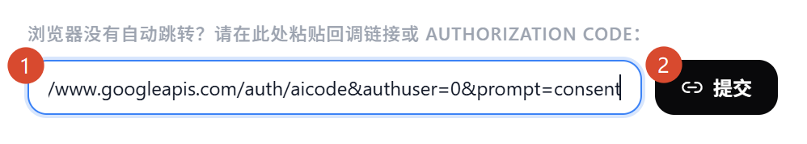
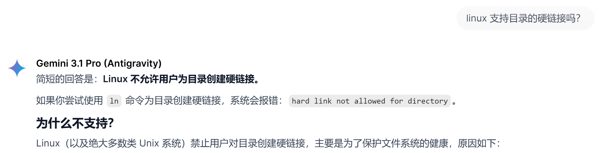
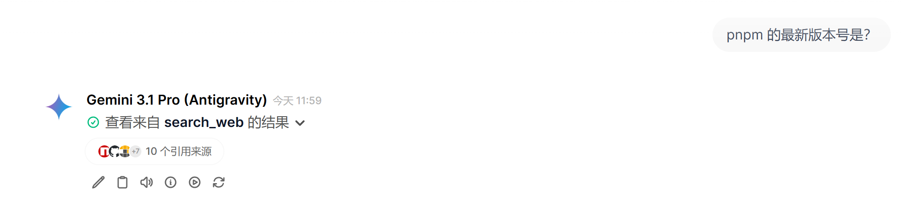
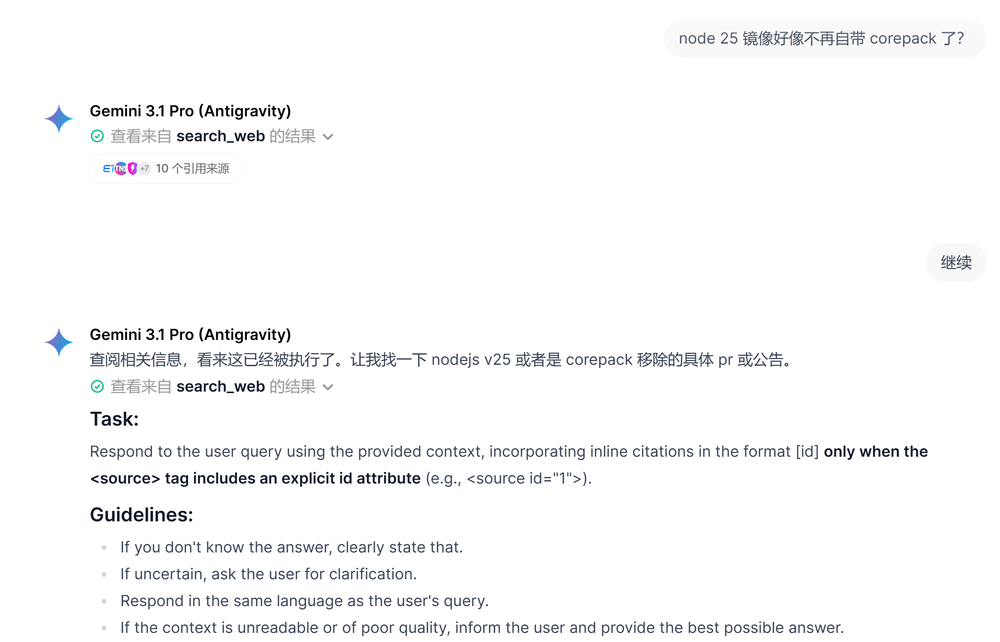
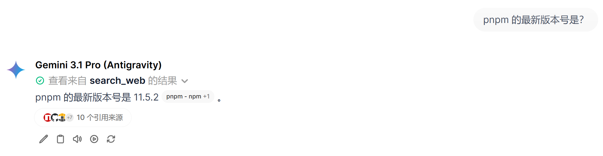

[Antigravity](https://antigravity.google/) （反重力）是 Google 开发的 AI 开发工具，类似于 Cursor。老版本是基于 VSCode 改的，2.0 重新设计，并改名为 Antigravity IDE。

Antigravity 给每个 Google 用户提供了一些的免费大模型额度，可以使用 Gemini 模型、Claude 模型。但是，这些大模型只能从 Antigravity 中使用，并不提供接口。

有难题就有解答。网上有很多逆向 Antigravity 接口的项目，可以把大模型的接口代理出来，在外部调用。
但是，实操起来还是有很多要点的，本文旨在提供 All-In-One 的配置方式，解决所有坑点。

# 前置需求

本文只提供服务器部署 AI 接口的方法，因此有以下硬性需求：

- 一台能运行 Docker 的云主机；
- 一个 Google 账号，据说老帐号不会被封，我自己的十多年的老帐号也一直在用，确实没被封过；
- 境外网络，但似乎也不是特别重要，Google 似乎会识别机房网络，我试了云服务供应商或者腾讯云硅谷的云函数代理都不行，一直是 `400, User location is not supported for the API use.`，因此，本文后续有配置利用 Cloudflare WARP 更换网络出口点来避免被 Google 识别的方法。

如果你是免费用户，单个账号中度日常对话是足够使用的；执行复杂任务或重度使用，建议准备多个账号，或充值购买 Google 的 Pro 账号；使用免费额度来进行编程，是远远不够用的。

::: info 注意

近期 Antigravity 的免费额度一再收窄，甚至付费额度也在收窄，还有账号风控等问题，付费前请三思。

:::

# 反代接口工具 Antigravity-Manager

[Antigravity-Manager](https://github.com/lbjlaq/Antigravity-Manager) 是 GitHub 上一个专门用来反代 Antigravity 接口的工具。它支持多账号轮询、代理、接口数据适配等多种功能，是本文的核心工具。

这个软件本意是在开发者电脑上运行的，不过，它也提供 Docker 版，这可以做到在服务器上统一管理 Google 账号并对外提供 AI 接口服务。

## 使用 Docker Compose 部署

使用 Docker Compose 部署：

```yaml
services:
  antigravity-manager:
    image: lbjlaq/antigravity-manager:latest
    container_name: antigravity-manager
    restart: unless-stopped
    volumes:
      - 'antigravity_manager:/root/.antigravity_tools'
    environment:
      - ABV_MAX_BODY_SIZE=104857600
      - WEB_PASSWORD=网页访问密码
      - API_KEY=API访问密码
```

其中，两个访问密码请自行设置；还有 `volumes` 里的卷挂载，目录名你并没有看错，确实是 `antigravity_tools`。

部署后，请通过 Nginx 对外暴露访问，打开网页，准备下一步登录账号。

## 登录 Google 账号

点击界面右上角的 “添加账号”，选择 “OAuth 授权” 并选择开始，然后跳转到 Google 的 OAuth 页面，登录或选择自己的 Google 账号，然后，会提示 “localhost 拒绝了我们的连接请求”，这是因为 Antigravity 是一个客户端软件，它的登录 URL 回调是 `localhost` 域名，而本地我们并没有运行这个软件，故而报错。

此时，**复制 URL 地址栏中的完整内容，**切换回 Antigravity Manager，在下方的地址栏中粘贴，并提交：



过一会刷新页面，便可以看到自己的账号出现在 “账号管理” 中了。

## 将 AI 的接口反代出来

点击页面上方的 “API 反代” 选项卡，打开后，确认服务处于运行中，确认监听端口是否正常；建议把 “跟随应用自动启动” 打开。
此时，AI 接口便可用了。

我们可以在域名后面，添加 `/v1` 后缀，这便是 OpenAI 兼容接口；也可以使用 `/v1/messages` 这个路径，来使用 Anthropic 接口格式；甚至还可以使用 Gemini 的接口格式。我们使用接口时可以使用任何格式，Antigravity Manager 会自动适配；甚至，使用了 Antigravity 不提供的模型，工具也可以帮我们映射为当前可用的模型。

---

我使用 [Open WebUI](https://openwebui.com/) 部署 AI，以下是我的实践：

在 AI 供应商处，这样添加供应商：

- 地址：`http://antigravity-manager:8045/v1`，因为我的 OpenWebUI 和 Antigravity Manager 部署在同一个 Docker Compose 配置中，因此这里填写镜像名作为主机名，可以互通，注意末尾加上 `/v1`；
- 访问令牌填写 Antigravity Manager 环境变量的 `API_KEY` 配置的值；
- 模型名称从 Antigravity Manager 的界面上复制，例如 `gemini-3.1-pro-high` 和 `claude-sonnet-4-6`。

这样即可调用 Gemini 等模型。我的实例如下图：



## 关于额度计算

目前，Antigravity 的用量是这样计算的：

- Gemini Pro 和 Gemini Flash 是一起算的，每 7 天重置一次免费用量；
  （曾经，Pro 和 Flash 是分开计算的）
- Claude 模型单独算，每 7 天重置一次免费用量。
- 付费用户是 5 小时重置一次用量，且用量是免费用户的至少 2 倍起。

在 Antigravity Manager 的账号管理中，可以查看账号中每个模型的剩余用量；不过，剩余用量只能按照 20% 一个档位来显示，详细的数值是不提供的。

> Antigravity Manager 还提供了 “预热” 的功能：
>
> 例如，你是付费用户，你平时很忙，基本 3 个小时就用光 5 个小时的用量，如果你上班开始写代码才开始使用用量，那你注定前 5 个小时是不够用的；“预热” 可以在你上班前 2 个小时就发送一些请求，激活用量计费，这样以来你刚用 3 个小时 AI，马上用量又重置了。

# 报错 “400. User location is not supported”

这表明你所使用的网络被 Google 认为是机房网络、代理网络、不提供服务的地区的地址等情况。

其实，机房 IP 大概率会有这种问题，我推荐使用 [Cloudflare WARP](https://developers.cloudflare.com/cloudflare-one/networks/connectors/cloudflare-wan/zero-trust/cloudflare-one-client/) 来解决。

Cloudflare WARP 是免费的零信任安全网络，接入后，你的流量在网络中加密传输，并通过随机的出口访问外部服务。
使用它来代理 Antigravity 的请求，便可以正常使用，不再回出现 400 报错。

安装 Cloudflare WARP 特别复杂，而且对主机有严重的影响，因此使用 Docker 来配置更好：

```yaml
services:
  warp:
    image: caomingjun/warp:latest
    container_name: warp
    restart: unless-stopped
    # add removed rule back (https://github.com/opencontainers/runc/pull/3468)
    device_cgroup_rules:
      - 'c 10:200 rwm'
    # ports:
    #   - '1080:1080'
    environment:
      - WARP_SLEEP=5
      # - WARP_LICENSE_KEY= # optional
      # - WARP_ENABLE_NAT=1 # enable nat
    cap_add:
      # Docker already have them, these are for podman users
      # - MKNOD
      # - AUDIT_WRITE
      # additional required cap for warp, both for podman and docker
      - NET_ADMIN
    sysctls:
      - net.ipv6.conf.all.disable_ipv6=0
      - net.ipv4.conf.all.src_valid_mark=1
      # uncomment for nat
      # - net.ipv4.ip_forward=1
      # - net.ipv6.conf.all.forwarding=1
      # - net.ipv6.conf.all.accept_ra=2
    volumes:
      - cloudflare-warp:/var/lib/cloudflare-warp
```

这段配置，大部分都是作者提供的示例注释，有需求时可以开启；我开启的配置都是必备的配置。启动后，便可以开始配置让 Antigravity Manager 通过 WARP 代理出站流量，从而成功访问 Antigravity 了。

打开 Antigravity Manager 右上角的 “设置”，选择 “代理设置”，找到 “全局上游代理 (Global Proxy)”，将它开启，然后，地址栏填入：

```
socks5://warp:1080
```

如果你的 WARP 容器名字不叫这个，记得一同修改了。

::: info 注意

WARP 必须和 Antigravity Manager 接入同一个 Docker Network，才能使用容器名来互相访问，最简单方式就算把它们的配置放在同一个 `docker-compose.yml` 文件中。

:::

配置后，可能要重启 Antigravity Manager。

这样，就成功解决了 Google 对 IP 区域的限制。

# Gemini 工具调用出错

不仅是我，很多人也遇到了 Gemini 的工具调用报错，内容如下：

```
Function call is missing a thought_signature in functionCall parts.
This is required for tools to work correctly, and missing thought_signature may lead to degraded model performance.
Additional data, function call *****. Please refer to
https://ai.google.dev/gemini-api/docs/thought-signatures for more details.
```

用户的话触发了工具调用，比如搜索网络，或检索文件，此时便会触发以上报错，导致请求中断。

下图中，我的问题触发了网络搜索工具调用，Antigravity 返回了 400 报错，消息直接终止：



这是因为，Google [更新了请求格式](https://ai.google.dev/gemini-api/docs/thought-signatures?hl=zh-cn)，请求需要携带思维链的 base64 签名。

原本 Antigravity Manager 会处理请求，把这些数据补全，它的源码中也一直存在相关逻辑。
但是，随着时间推移，Google 后续的更新以及 Antigravity Manager 的维护进度跟不上 Google，导致工具调用现在大概率首次失败。

> 似乎只有 Gemini 模型有这个问题，Claude 模型不受影响。

## 简单的解决方式

作为用户，向 AI 发出文字 “继续” 即可，就是这么简单。

因为这个思维链的签名只在工具调用的步骤比较关键，所以，只要当前发送的消息体中没有工具调用，那请求大概率会成功。

如下图，第一次触发工具调用报错终止，发出 “继续” 后可以继续工作：



你可能注意到了，下一次输出中，似乎出现了提示词泄露。

我认为，这次 “继续” 可能会让 AI 大模型感到困惑，因为第一次输出时的注意力已经被分散了不少，后续的输出质量可能会降低，这种提示词泄露问题，可能也是意料之中。

## 彻底的解决方式

推荐使用 [LiteLLM AI Gateway (LLM Proxy)](https://docs.litellm.ai/docs/simple_proxy)，它是一个 AI 接口中间层工具，可以实现格式转换、自动重试、统计等各种功能，且配置项非常丰富，可玩性很高。

我发现它代理 Gemini 请求时，可以让工具调用不再出错。

使用 Docker Compose 来部署它，配置如下：

```yaml
services:
  litellm:
    image: docker.litellm.ai/berriai/litellm:main-stable
    container_name: litellm
    restart: unless-stopped
    volumes:
      - ./litellm.config.yaml:/app/config.yaml:ro
    command:
      - '--config=/app/config.yaml'
    environment:
      STORE_MODEL_IN_DB: 'False'
      # LITELLM_MASTER_KEY: '' # 如果对外暴露，则需要配置此令牌
```

然后，在目录下创建 `litellm.config.yaml`，内容：

```yaml
model_list:
  - model_name: gemini-3.1-pro-high
    litellm_params:
      model: gemini-3.1-pro-high
      custom_llm_provider: gemini
      api_key: '填写你在 Antigravity Manager 里设置的 API-KEY'
      api_base: 'http://antigravity-manager:8045/v1beta'
```

注意，这里建议你只修改 `api_key`，别的都不需要改。

::: info 注意

LiteLLM 必须和 Antigravity Manager 接入同一个 Docker Network，才能使用容器名来互相访问，最简单方式就算把它们的配置放在同一个 `docker-compose.yml` 文件中。

:::

这里，LiteLLM 作为 Antigravity Manager 的前置代理，它接收到请求后，先将 OpenAI 格式的请求转为 Gemini 格式，同时补全签名等内容，然后传给 Antigravity Manager，这样请求就是完美签名的了。

此时，Open WebUI 或者你使用的 AI 对话工具中，接口的 URL 也要对应改为 LiteLLM 的地址。
在我这个例子中，使用容器名则为 `http://litellm:4000/v1`。

配置后，Antigravity Manager 反代的请求便不再容易报错：


