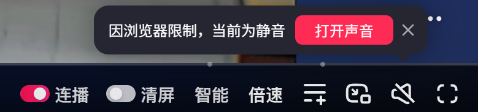
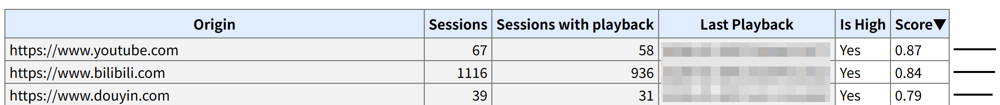

现在很多视频网站或短视频网页，点进去以后会发现视频已经在播放了，但是没有声音，界面上通常会显示一个按钮：“点击取消静音”：



这当然不是网站忘了打开声音，也不是视频播放器故意做得奇怪，而是浏览器的自动播放策略导致的。

简单来说：**浏览器通常允许静音视频自动播放，但不允许一个网页在没有用户操作的情况下突然发出声音。**

# 为什么要限制自动播放

如果浏览器不限制自动播放，那么网页一打开就可以直接播放带声音的视频或音频。

这在技术上并不复杂，例如：

```html
<video src="/video.mp4" autoplay></video>
```

这里的 `autoplay` 属性就是开启自动播放；也可以使用 JS 来启动播放：

```js
const video = document.querySelector('video')

video.play()
```

但问题在于，这种体验对用户来说很糟糕：

- 用户可能在公共场合、会议、课堂中打开网页；
- 页面可能在后台标签页中加载，声音响了以后还不好找到来源；
- 移动网络下，自动播放还会消耗流量和电量；
- 如果是自动播放广告，这将极大地影响用户体验。

所以现代浏览器逐渐收紧了自动播放策略，把是否允许播放声音这件事交还给用户。

Chrome 的官方文档中提到，Chrome 从 2018 年 4 月开始调整自动播放策略，目标就是改善用户体验、减少用户安装广告拦截器的动机，以及降低流量消耗。
可以参考官方文章：[Autoplay policy in Chrome](https://developer.chrome.com/blog/autoplay)。

## Chrome 的自动播放规则

Chrome 的规则是这样的：

- 静音自动播放总是允许的；
- 有声音的自动播放，只有在满足一些条件时才允许；
- 顶层页面可以通过权限策略，把自动播放权限委托给 iframe。

这里最重要的是第一条：**静音自动播放总是允许的**。
所以视频网站如果希望视频一打开就能动起来，通常会先把视频设置为静音，再提供一个“点击取消静音”的按钮。

例如：

```html
<video src="/video.mp4" autoplay muted playsinline></video>
```

这里的 `autoplay` 表示自动播放，`muted` 表示静音，`playsinline` 表示在移动端尽量以内联方式播放，而不是自动进入全屏。

然后，提供一个取消静音的按钮：

```js
const video = document.querySelector('video')
const button = document.querySelector('button')

button.addEventListener('click', () => {
  video.muted = false
})
```

这就是 “点击取消静音” 的基本实现方式。

# 为什么有的网站可以有声自动播放

Chrome 并不是完全禁止有声音的自动播放，而是要求满足一些条件。

比较常见的情况有：

- 用户已经和当前网站发生过交互，例如点击、触摸过页面；
- 在桌面端，用户经常在这个网站观看带声音的视频；
- 用户把网站安装成了 PWA，或在移动端把网站添加到了主屏幕；
- iframe 获得了顶层页面授予的自动播放权限。

具体判断方法是，Chrome 使用一个叫做 **Media Engagement Index （媒体互动指数）** 的分数机制，它会根据用户在某个网站上的媒体播放行为计算分数。
例如：

- 播放时间是否超过 7 秒；
- 媒体是否有声音且没有静音；
- 播放时标签页是否处于激活状态；
- 视频尺寸是否足够大，必须大于 200 × 140 像素尺寸。

如果一个网站经常被用户主动用来观看视频，比如视频网站，那么 Chrome 可能会允许它在桌面端自动播放带声音的视频。
但如果一个新闻网站只是偶尔在文章里塞一个视频，那么它通常不应该假设自己可以直接播放声音。

这也是为什么同样是自动播放，有些网站、有些浏览器、有些账号环境下表现不完全一致。

---

可以在浏览器地址栏中输入 `chrome://media-engagement`，来查看你访问过的所有曾播放过视频的网站：



这会呈现出一个表格，其中列出了域名、会话数、有播放的会话数、是否满足自动播放的评分、媒体互动指数。
可以看到，常用的视频网站，分数都很高，因为每次打开总是会播放视频，它们的 “Is High” 值为 “Yes”。

满足 “Is High” 的分数，Google 并没有明确说明，但分界点应该在 0.3 ~ 0.4 之间。

# 开发者的处理方式

首先，不能假设 `video.play()` 一定会成功，`HTMLMediaElement.play()` 会返回一个 Promise，如果浏览器阻止了播放，这个 Promise 会被 reject。

考虑到视频自动播放有可能会被阻止，所以建议在页面上放置相关提示和 “取消静音播放” 的按钮，它们可以初始就是隐藏状态：

```html
<video src="/video.mp4" muted playsinline></video>

<div id="auto-play-tips" hidden>
  <p>浏览器阻止了自动播放，请点击按钮继续播放。</p>
  <button class="play-button" type="button">取消静音播放</button>
</div>
```

播放器带有 `muted` 属性，且不要带有 `autoplay` 属性；
然后，自动播放的代码改为：

```js
const video = document.querySelector('video')
const autoPlayTips = document.querySelector('#auto-play-tips')
const playButton = document.querySelector('.play-button')

const promise = video.play()

if (promise) {
  // 此时自动播放失败
  promise.catch(() => {
    // 显示自动播放提示
    autoPlayTips.hidden = false
  })
}

playButton.addEventListener('click', async () => {
  video.muted = false
  await video.play()
  autoPlayTips.hidden = true
})
```

---

如果视频不作为页面主体内容，例如首页背景视频、商品展示视频，常见做法是：

```html
<video autoplay muted loop playsinline poster="/poster.jpg">
  <source src="/video.mp4" type="video/mp4" />
</video>
```

这里的 `<video>` 的属性 `poster` 是封面图，视频未加载或播放失败时会展示，而 `loop` 表示循环播放。

如果页面真正需要声音，例如在线课堂、语音聊天室、网页游戏，那么更推荐先展示一个明确的 “开始”、“播放”、“进入房间” 之类的按钮。
用户点击以后，再创建音频上下文或调用播放逻辑。

## 能否绕过限制

和 “打开新窗口 `window.open()`” 类似，以开启声音的方式启动某视频的播放，或是取消某个静音播放的视频，**必须是由用户的真实点击操作来触发**，通过 JS 触发的点击无效。
而且，还必须在用户真实操作的事件处理函数中**同步**执行。

实际开发中，有一种做法是给整个页面绑定点击回调，这并不是一种好的做法。更推荐的还是弹出提示告知用户，点击按钮以取消静音。

## Web Audio API

自动播放策略不只影响 `<video>` 和 `<audio>`，也会影响 Web Audio API。

例如网页游戏、在线乐器、音频可视化工具，可能会在页面加载时创建 `AudioContext`。
在 Chrome 中，如果在用户操作之前创建音频上下文，它可能会处于 `suspended` 状态，需要在用户点击之后调用 `resume()`。

示例：

```js
const audioContext = new AudioContext()
const startButton = document.querySelector('button')

startButton.addEventListener('click', async () => {
  await audioContext.resume()
})
```

所以如果一个网页游戏提示你 “点击开始游戏”，这背后也可能和浏览器的音频策略有关。
点击行为不只是开始游戏流程，同时也给了浏览器一个明确的用户激活信号。

# 其它浏览器

不同浏览器的细节不完全一样，但大方向相同：**不希望网页在用户没有预期的情况下突然发出声音**。

MDN 文档 [Autoplay guide for media and Web Audio APIs](https://developer.mozilla.org/en-US/docs/Web/Media/Guides/Autoplay) 总结了一个通用规则：
如果媒体是静音的，或者没有音轨，通常不会被自动播放策略拦截；
如果媒体有声音，那么通常需要用户先和页面产生交互。

---

Safari / WebKit 也有类似策略。
WebKit 在介绍 iOS 视频策略时提到，静音视频或没有音轨的视频可以在不需要用户手势的情况下播放；但如果视频后来获得了音轨，或者在没有用户手势的情况下取消静音，播放可能会被暂停。
可以参考 WebKit 的博客文章：[New video Policies for iOS](https://webkit.org/blog/6784/new-video-policies-for-ios/)。

---

iOS 上还需要特别注意 `playsinline`。
早期 iPhone 上的视频播放经常会自动进入全屏，而 `playsinline` 的作用就是告诉浏览器：这个视频希望在页面内播放。
因此，为了兼容移动端，常见的视频自动播放代码都会写成：

```html
<video autoplay muted loop playsinline></video>
```

# 浏览器相似的拦截行为

这种限制并不只存在于视频自动播放中，现代浏览器里有很多能力，都隐式要求 “用户主动触发” 后才能使用。

注意，这里并不是说像 “读取剪贴板” 或 “申请定位权限” 那样弹出一个确认权限的界面，而是浏览器内部约束开发者，大部分影响交互体验的行为是无法通过 JS 来实现的，必须由用户真实操作来触发。

例如：

- 新窗口打开 `window.open()`；
- 全屏显示 `requestFullscreen()`；
- 上文中提到过的 Web Audio API；
- 等等...

> 其实，手机 App 的 “跳转其它 App” 也是需要用户真实操作才能触发，无法通过代码触发的，可以理解成跳转行为必须放在事件监听器里。
> 所以，开屏广告跳转其它 App，要么点击广告跳转，这触发了点击事件的监听器，要么 “摇一摇”，这触发了陀螺仪事件的监听器。
