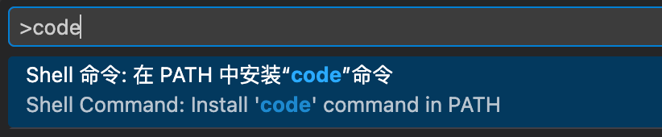
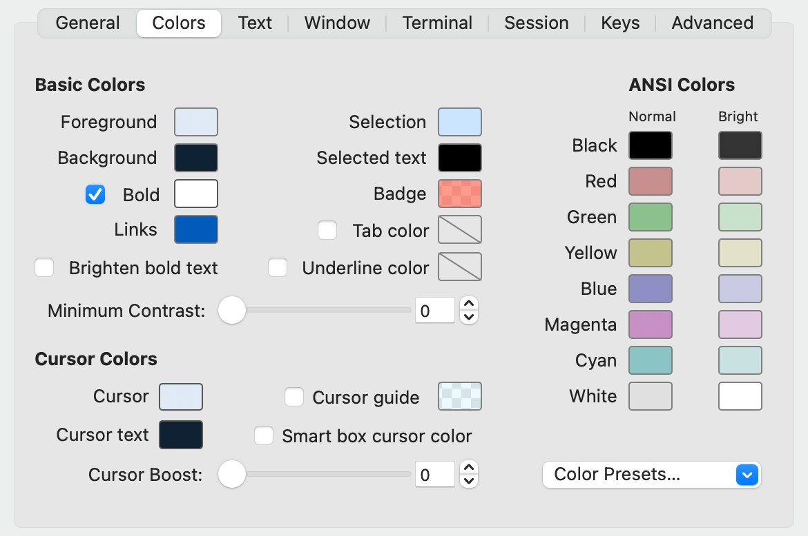
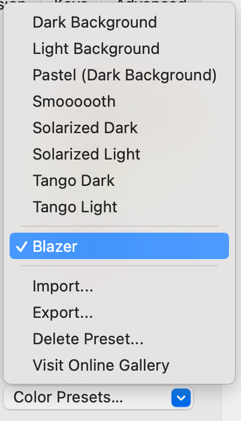
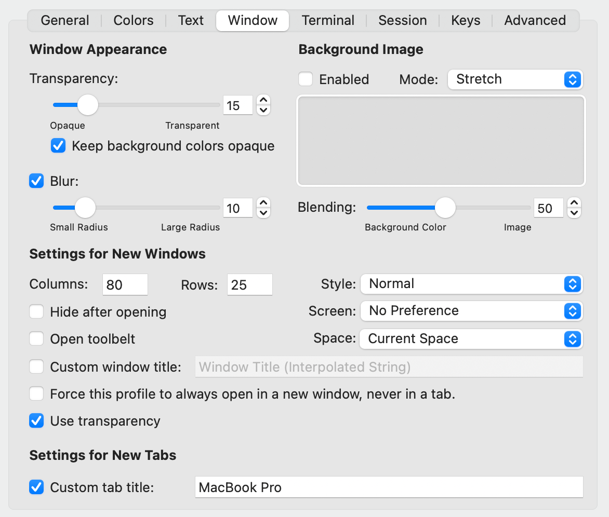
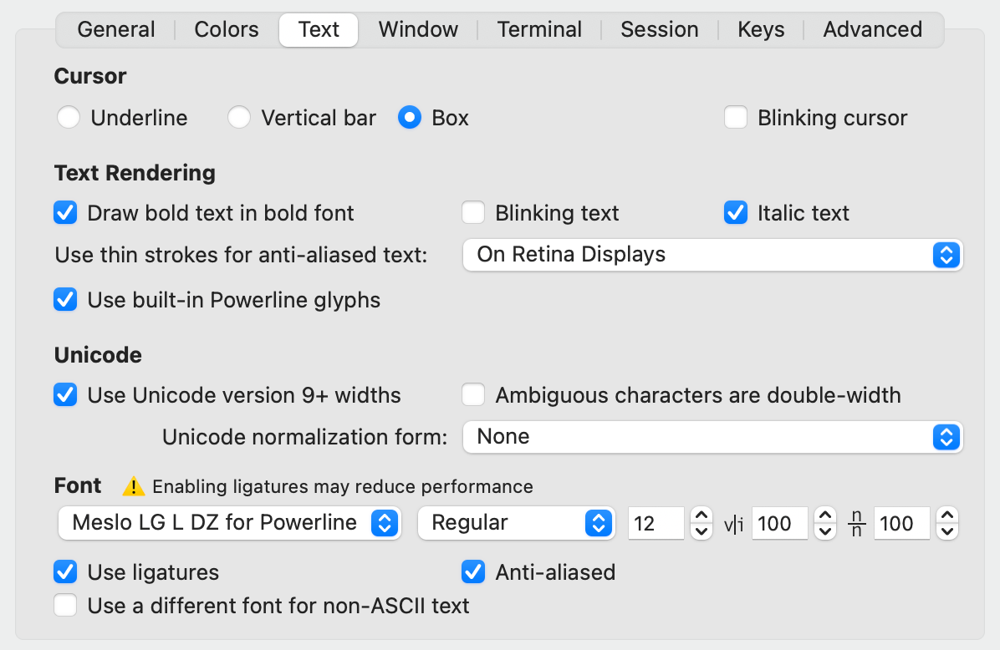
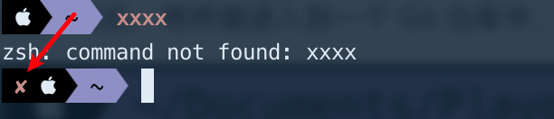
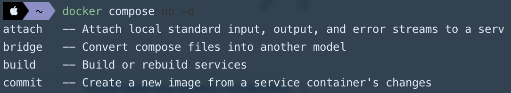
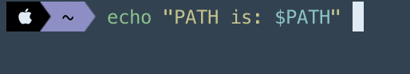

记录 macOS 配置 iTerm2 相关过程。本文的 iTerm2 和 zsh 配置部分，参考了 [这篇博文](https://pjchender.blogspot.com/2017/02/mac-terminal-iterm-2-oh-my-zsh.html)；命令行前缀定制部分，参考了 [这篇博文](https://github.com/solomonxie/blog-in-the-issues/issues/27)。

本文于 2026 年更新，部分非最佳做法已被修正，且在插件方面做了额外扩充。

# 前置条件：Homebrew

[Homebrew](https://brew.sh/zh-cn/) 是 macOS 必备的软件包管理工具，类似于 apt-get。

安装命令：

```bash
/bin/bash -c "$(curl -fsSL https://raw.githubusercontent.com/Homebrew/install/HEAD/install.sh)"
```

如果你访问 GitHub 不畅通，也可以试试使用国内的镜像源，例如 [清华镜像源](https://mirrors.tuna.tsinghua.edu.cn/help/homebrew/)、[南大镜像源](https://mirror.nju.edu.cn/) 等；
使用国内镜像源时，需要按照链接网页里的步骤安装。

安装完成后，通过以下命令确定是否成功：

```bash
brew --version
```

# 前置条件：Git

因为 oh-my-zsh 等工具通过 Git 进行更新，所以必须安装 Git。
在 macOS 上，推荐使用 Homebrew 来安装 Git。

安装命令：

```bash
brew install git
```

安装完成后，通过以下命令确定是否成功：

```basb
git -v
```

# 推荐前置条件：VSCode

因为后续步骤需要更改配置文件，为了方便，建议安装 VSCode 或其他 IDE。

安装时，如果有选项可以把 `code` 命令作为快捷启动 VSCode 的选项，建议勾选；
如果没有这个选项，或者 VSCode 你已经安装过了，可以通过快捷键 `Command` + `Shift` + `P` 开启命令面板，输入 `code` 后，会有一个菜单项：



选择这个 “Shell 命令: 在 PATH 中安装 "code" 命令”，此后终端中输入 `code` 便可以立即通过 VSCode 打开当前目录或文件；
编辑配置文件时，可以直接通过命令快速启动 VSCode，非常方便。

# iTrem2 安装

[iTerm2](https://iterm2.com/) 就是本文的主角，它是 macOS 上最好用的终端之一。

可以通过 [官网下载页面](https://iterm2.com/downloads.html) 进行安装，或通过 Homebrew 安装。
如果通过 Homebrew 安装，运行命令：

```bash
brew install --cask iterm2
```

安装好后，记得把 iTerm2 放置到 Dock 栏。

# iTrem2 外观配置

安装完成后，我们可以为自己的终端挑选一套配色。
按下 `⌘` + `,` 组合键，打开首选项，选择 “Profiles” 选项卡，此页面记录着终端的各种配置，我们跳转到 “Colors” 配色方案页面。



这个页面可以用于调节终端的配色主题，右下角那个菜单可以让我们导入/导出配置文件：



其中预设的几种配色，我觉得都不满意。
可以通过这个网站从别人设计好的配色中挑选一套：https://iterm2colorschemes.com/ ，找到满意的配色后下载其配置文件。

我个人选用的是 [Blazer](https://raw.githubusercontent.com/mbadolato/iTerm2-Color-Schemes/master/schemes/Blazer.itermcolors) 主题，下载其 .itermcolors 后缀的配置文件，存储在电脑上，然后从选单 “Color Presets...” 中选择 “Import…” 进行导入，导入配色主题后即可。

这个界面中，“Basic Colors” 可以指定终端背景颜色、粗体文字颜色、链接文字颜色、已选择文字颜色等，我的最终设置如图，其中设置了背景颜色 `0e2132`。

---

修改了配色后，还可以对窗口进行定制化，切换到 “Window” 选项卡，如图：



图中是我自己的配置，我开启了窗口的半透明，并调整了 15% 透明度以及 10% 背景模糊，设置了新窗口的大小，还可以自定义窗口标题。

# oh-my-zsh 安装

现在的 macOS 默认就是使用 [zsh](https://www.zsh.org/)，这是一个强大的命令行工具，所以我们不需要额外安装 zsh；
但是，我们需要 [oh-my-zsh](https://ohmyz.sh/) 这个工具来对 zsh 进行扩展增强，oh-my-zsh 需要我们手动安装。

安装 oh-my-zsh，只需执行以下命令：

```bash
sh -c "$(curl -fsSL https://install.ohmyz.sh/)"
```

考虑到国内访问 GitHub 不太畅通，不推荐从 GitHub 的域名安装。

---

oh-my-zsh 通过其 [GitHub 仓库](https://github.com/ohmyzsh/ohmyzsh) 来分发，安装步骤中会 Clone 一份源码到你电脑的 `~/.oh-my-zsh` 目录。
后续的更新升级，其实就是 `git pull` 操作拉取最新代码。

通过以下命令在 VSCode 中打开 oh-my-zsh 安装的源码：

```bash
code ~/.oh-my-zsh
```

<br />

注意，定制 oh-my-zsh 时不能图方便而直接修改源码，不然以后更新升级时，`git pull` 会出现冲突报错，导致更新失败。

正确的做法是，把插件、主题放置在 `custom` 目录中，oh-my-zsh 会自动从这个目录中加载插件和主题；
而且，oh-my-zsh 通过 `.gitignore` 文件排除了 `custom` 目录，因此这个目录下的任何文件改动不会影响后续的更新升级。

# oh-my-zsh 配置主题

对 oh-my-zsh 的第一个配置，就是更换主题。

我使用名为 “agnoster” 的主题。
它提供了对 Git 更好的支持，只要当前位于 Git 目录中，便可以显示分支名和当前工作区状态；它还支持 Powerline 字体、支持显示上一条命令执行结果，功能很多，非常推荐。

通过 VSCode 编辑 zsh 的配置文件：

```bash
code ~/.zshrc
```

找到以 “`ZSH_THEME`” 开头的内容，大约在第 10 行左右，修改为：

```bash
ZSH_THEME="agnoster"
```

最后重新加载 zsh 配置即可：

```bash
source ~/.zshrc
```

配置此主题后，进入 Git 目录，或者是我们的指令运行成功 or 失败，都会有对应的 icon 显示在终端中。
不过，这通常要配合特定的字体，下文中会有讲到，请继续完成配置。

# oh-my-zsh 主题定制：前缀

oh-my-zsh 会把用户名和主机名放在最前面，例如：`> root@macos ~`，这部分内容没有意义，白占空间，大部分人都会把这段前缀隐藏掉。这需要我们定制主题。

我使用 “agnoster” 主题，它是内置主题，文件位于 oh-my-zsh 本地源码的 `./themes` 目录下，因此我们不能直接修改它，否则以后更新 oh-my-zsh 时，会因源码被修改而 `git pull` 失败。

首先使用 VSCode 浏览 agnoster 主题文件：

```bash
code ~/.oh-my-zsh/themes/agnoster.zsh-theme
```

找到以下内容，大约位于 165 行：

```bash
# Context: user@hostname (who am I and where am I)
prompt_context() {
  if [[ "$USERNAME" != "$DEFAULT_USER" || -n "$SSH_CLIENT" ]]; then
    prompt_segment "$AGNOSTER_CONTEXT_BG" "$AGNOSTER_CONTEXT_FG" "%(!.%.)%n@%m"
  fi
}
```

这里的 `prompt_segment` 就是默认情况下的前缀提示。

我们把这个 `prompt_context()` 函数整段复制，然后通过 `code ~/.zshrc` 打开 zsh 的配置文件，在最尾部粘贴进去。

然后，修改 `.zshrc` 中的函数，把它改为：

```bash
prompt_context() {
  if [[ "$USERNAME" != "$DEFAULT_USER" || -n "$SSH_CLIENT" ]]; then
    prompt_segment black default ""
  fi
}
```

保存后，通过 `source ~/.zshrc` 重载 zsh 配置即可。

# iTerm2 字体修改

默认的字体的 “功能性” 不强，所以一般会换用专为终端设计的字体，这是一种名为 “Powerline” 类型的字体，它能提供更好的显示。

可以在 [这个仓库](https://github.com/powerline/fonts) 中找到市面上大部分 Powerline 字体。
我使用 **“Meslo LG L DZ for Powerline”** 这一款字体，在这个仓库的 [这个目录](https://github.com/powerline/fonts/tree/master/Meslo%20Dotted) 中可以找到它的字体文件，下载后可以在系统中直接双击安装。

安装好 “Meslo LG L DZ for Powerline” 字体后，我们来配置 iTerm2，让它应用这款字体。

切换到 “Profiles / Texts” 选项卡，在此页面对字体进行配置，如下图：



这张图中的配置比较重要，配置时请尽量完全匹配。

<br />

此外，还有一处需要配置，切换到 “Terminal” 选项卡，找到 “Shell Integration”，取消勾选 “Show mark indicators”，如下图：


这是每一行开头的小箭头，因为我使用大背景色块的字体，所以不需要这个。
如果你不使用 Powerline 字体，或者，使用了无背景色块的字体，那么不用取消勾选。

<br />

配置完成后，将终端进入到一个 Git 仓库中，应该显示成这样：


可以看出，命令行标记、目录、Git 分支之间，使用了一种箭头形状的背景，看起来非常清晰；分支名前面，还有一个表示分支的符号。

未提交的 Git 仓库：


未提交的 Git 仓库，其分支名会变为黄色，还会有表示工作区有变更的 “±” 标志。

如果前一条命令失败，则新的命令行最左侧会出现一个叉号：



如果上面都能如图正常显示，则表示配置正确。

这个箭头形状的背景色块，就是 “Powerline glyphs”，也就是上面的 “Use built-in Powerline glyphs” 配置项，必须开启它。

如果你对字号、间距等不满意，也可以在这个页面调整。

# oh-my-zsh 内置插件

oh-my-zsh 本身自带了很多开箱即用的插件，这些插件位于源码的 `./plugins` 目录下，我们可以按需启用；
当然，如果使用外部的插件，便需要手动安装了。

通过 `code ~/.zshrc` 用 VSCode 编辑 zsh 的配置文件：
大约在 70 多行，有插件的配置：

```bash
plugins=()
```

把你需要启用的插件名写入这个括号里面，用空格或换行分隔即可。

这里给出一份我使用的插件列表：

```bash
plugins=(git git-lfs macos npm yarn rclone ssh docker docker-compose)
```

保存后，通过 `source ~/.zshrc` 重载 zsh 配置即可。

这些插件为开发者常用的命令提供用法手册，按下 `Tab` 键即可触发。
例如，安装了 `docker-compose` 插件后，`Tab` 触发提示：



对于比较复杂的命令，插件还提供了一些简短的别名，方便使用。
例如，安装了 `git` 插件后，可以使用 `git_current_branch` 快速获取当前分支，可以通过 `gb` 快速列出本地所有分支。

# oh-my-zsh 外部插件

内置插件只能提供一些有限的工具支持，我们还需要安装一些外部插件：

- [zsh-autosuggestions](https://github.com/zsh-users/zsh-autosuggestions)（命令建议），它可以提供历史命令提示，让频繁使用的命令可以瞬间完成输入；
- [zsh-syntax-highlighting](https://github.com/zsh-users/zsh-syntax-highlighting)（语法高亮），它可以为命令行文本提供语法高亮；
- [zsh-completions](https://github.com/zsh-users/zsh-completions)（更多补全），这是一个可选的插件，它自带了一系列命令行的自动补全，大部分都是原生插件没有提供的，例如 `jest` 命令；如果你想支持更多命令的补全，可以安装它。

以下给出我使用的安装步骤，仅供参考，更推荐参考 GitHub 文档来安装，因为工具可能会更新。

## 安装 zsh-autosuggestions

首先，把插件代码克隆到 zsh 的外部插件目录下

```bash
git clone https://github.com/zsh-users/zsh-autosuggestions ${ZSH_CUSTOM:-~/.oh-my-zsh/custom}/plugins/zsh-autosuggestions
```

通过 `code ~/.zshrc` 用 VSCode 编辑 zsh 的配置文件：
在大约 70 行，找到插件列表，把 `zsh-autosuggestions` 加进去：

```bash
plugins=(git git-lfs macos npm yarn rclone ssh docker docker-compose zsh-autosuggestions)
```

保存后，通过 `source ~/.zshrc` 重载 zsh 配置即可。

---

正确配置此插件后，输入任何历史输入过的命令的前半段，就会在后面用暗淡的颜色显示完整的命令，使用方向键 `→` 即可快速输入：


我们使用深色背景，这个快速建议文本显示看不清楚，需要修改它的显示效果。
继续编辑 `.zshrc`，在末尾添加一行：

```bash
ZSH_AUTOSUGGEST_HIGHLIGHT_STYLE='fg=242'
```

其中的 “`fg=242`” 这个数字可以随便调，最高 `255`，数值越大文字便越亮。
调整后，建议文本就更亮更容易看清了，如下图：


## 安装 zsh-syntax-highlighting

通过 Homebrew 安装：

```bash
brew install zsh-syntax-highlighting
```

然后，更新配置文件：

```bash
echo "source $(brew --prefix)/share/zsh-syntax-highlighting/zsh-syntax-highlighting.zsh" >> ${ZDOTDIR:-$HOME}/.zshrc
```

最后，通过 `source ~/.zshrc` 重载 zsh 配置即可。

注意，这个安装过程不需要修改 `plugins=(...)`；且更新配置文件的步骤，添加的那一行代码必须位于 `.zshrc` 的尾部，后续编辑时需要注意。

---

正确配置此插件后，输入复杂的命令，能正确显示代码高亮：



## 安装 zsh-completions

首先，把插件代码克隆到 zsh 的外部插件目录下：

```bash
git clone https://github.com/zsh-users/zsh-completions.git ${ZSH_CUSTOM:-${ZSH:-~/.oh-my-zsh}/custom}/plugins/zsh-completions
```

通过 `code ~/.zshrc` 用 VSCode 编辑 zsh 的配置文件：
在大约 75 行，`plugins` 的后面，插入以下内容：

```bash
# 之前：
plugins=(...)

# 你要添加的两行：
fpath+=${ZSH_CUSTOM:-${ZSH:-~/.oh-my-zsh}/custom}/plugins/zsh-completions/src
autoload -U compinit && compinit

# 之后：
source "$ZSH/oh-my-zsh.sh"
```

最后，通过 `source ~/.zshrc` 重载 zsh 配置即可。

注意，这个安装过程不需要修改 `plugins=(...)`；且更新配置文件的步骤，添加的那两行代码位置需精确。
