拖了接近一年的一篇文章，介绍我近期一直在使用的笔记软件——Joplin。
它可能不是最好的，下文讲到了很多缺点，但它确实有自身的独特之处，值得一试。

# 为什么选择 Jopin

笔记软件有很多，例如 OneNote、印象笔记、石墨文档、有道云笔记、语雀，甚至企业微信、钉钉都可以用来写笔记。

但是，这些软件基本都属于商业软件，有商业化内容甚至广告，需要注册、实名制；更何况数据被厂商所掌控，一旦服务器出岔子或者倒闭，数据就有丢失的风险。

而且，作为开发者，我们还有针对 Markdown 格式、代码高亮、云同步等功能的硬性要求，最好还能支持插件，能私有化数据。这些功能对于商业笔记软件而言，属于小众需求，厂商出于成本考虑，也不会提供这些。

<br />

Joplin 就是这样一款开源、可私有部署的笔记软件。它原生支持 Markdown 语法，也可以使用类似 Word 一样的所见即所得模式，甚至可以同屏显示两者；它提供了安卓、iOS、PC、macOS 多个客户端，所有笔记和附件都能云端同步。

即使你没有服务器，Joplin 也能利用 S3 对象存储、WebDAV、OneDrive 等进行同步；比如你可以注册一个坚果云，使用坚果云免费的 WebDAV；Joplin 官方还提供了付费的云同步服务。
而且，Joplin 的服务端支持多账号、端到端加密，也就是说，你甚至可以和朋友共享一个服务端，使用各自的账号登录并同步，即使服务器持有者也无法读取其他人的笔记。

此外，电脑上的 Joplin 客户端可以自由安装插件；Joplin 官方还提供了浏览器上类似于印象笔记的 “剪藏” 插件，方便你快速保存喜欢的网页内容。

Joplin 官网：https://joplinapp.org
GitHub 仓库：https://github.com/laurent22/joplin
我部署的 Joplin 后端：https://joplin.paperplane.cc

# 服务端的安装和配置方式

服务端的配置文档，似乎被 Joplin 官方有意藏得很深；我在 GitHub 上找到一篇 Markdown 格式的 [服务端部署文档](https://github.com/laurent22/joplin/blob/dev/packages/server/README.md)，可供参考。

Joplin 需要 PostgreSQL 数据库来存储账户、笔记和附件。推荐的方式是使用 Docker 来部署，如果你没有数据库，那么可以一同把数据库也通过 Docker 来管理。

> Joplin 服务端的所有数据都存储在 PostgreSQL 中，不需要挂载卷，因此它可以非常方便的迁移。

使用 Docker Compose 部署：

```yaml
services:
  joplin:
    container_name: joplin
    image: joplin/server:latest
    depends_on:
      - postgres
    restart: unless-stopped
    volumes:
      - /etc/timezone:/etc/timezone:ro
      - /etc/localtime:/etc/localtime:ro
    environment:
      - APP_PORT=<端口号>
      - APP_BASE_URL=<网址>
      - DB_CLIENT=pg
      - POSTGRES_CONNECTION_STRING=postgresql://postgres:<密码>@postgres:5432/<数据库名>?schema=public
      - MAX_TIME_DRIFT=0
      - TZ=Asia/Shanghai

  # Joplin 依赖一个 PostgreSQL 或 MySQL 数据库
  # 如果你已经有可用的数据库了，下面这段则不需要
  postgres:
    image: postgres:latest
    container_name: postgres
    restart: unless-stopped
    environment:
      POSTGRES_USER: postgres
      POSTGRES_PASSWORD: <密码>
      TZ: Asia/Shanghai
    volumes:
      - <数据库持久化目录>:/var/lib/postgresql/data
```

**这里需要注意一点，我们在 `POSTGRES_CONNECTION_STRING` 中填写的 PostgreSQL 连接字符串中，包含了数据库名，我们需要手动去创建这个数据库，Joplin 不会自主创建。**

运行后，通过 Nginx 把网站对外暴露，然后通过浏览器访问即可到达登录页，如下图：

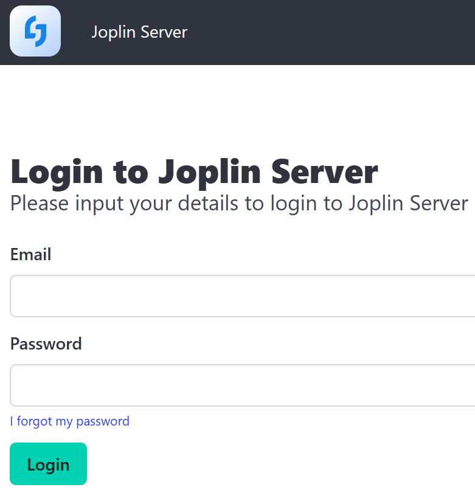

新部署的 Joplin 服务端，默认管理员邮箱 `admin@localhost`，默认密码 `admin`，输入后点击 “Login” 即可登录管理员后台。

---

登入后，会提示我们默认密码不安全，这里要注意了，**不要点击界面上的 “Change it now” 去自行修改邮箱和密码，因为服务端会尝试发送确认邮件；**
别忘了我们是管理员用户，正确的做法是，点击网页顶部的 “Admin” 进入后台管理，点击左侧的 “Users” 进入用户管理界面，点击我们的用户名，然后直接在编辑用户档案的页面修改用户名、邮箱、密码，别的选项最好不动，最后点击提交按钮即可。

# 客户端安装、使用和定制

本文主要介绍 PC / macOS 的 Joplin 客户端。
可以在 [官网下载页](https://joplinapp.org/download/) 下载并安装；
或者，在 [官网安装帮助页](https://joplinapp.org/help/install/) 有更细分的版本可供选择。

---

安装完成后，需要做的最重要的就是配置同步服务器，进入设置界面后，左侧侧边栏选择 “同步” 即可进入同步设置界面。
初次安装，可能会直接进入同步向导界面，如果你进入了此页面，直接配置即可。

::: info 提示

进入设置界面的方式，Windows 和 macOS 各不相同：

- Windows：顶部菜单 “工具” → “选项”
- macOS：顶部菜单 “Joplin” → “偏好设置”

后续会多次进入设置界面，不再赘述。

:::

Joplin 本身被设计成联机使用，因此它支持多种同步方式；
而我们自己部署了它的服务端，因此 “同步目标” 选择 “Joplin 服务器 (Beta)”。

然后，在 “Joplin 服务器 URL” 中填入我们自己部署的 Joplin 服务的完整网址，并在 “Joplin 服务器邮箱” 和 “Joplin 服务器密码” 中输入我们之前创建的账号的邮箱和密码，完成后，点击 “检查同步配置” 按钮，如果配置成功，会提示 “成功！同步配置看起来没问题。”

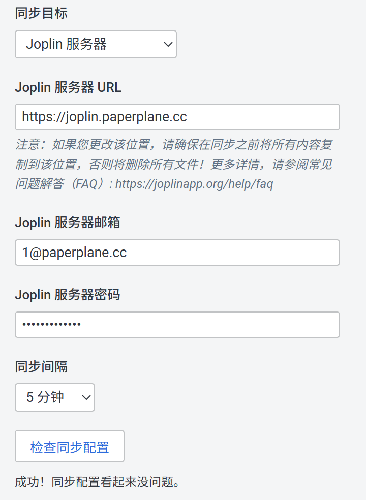

图示就是正确配置后，检查通过时的界面。
配置完成后，返回到主界面，点击左下角的 “同步” 按钮，能正常同步则表明配置完全正确。

# 客户端安装后必做的优化

默认情况下，尤其是对 Windows 用户而言，Joplin 的文本编辑器在文本字体和代码块方面都有些问题，例如默认是宋体字，代码块也不是等宽字体，甚至设置里的定制字体也不是很好用。

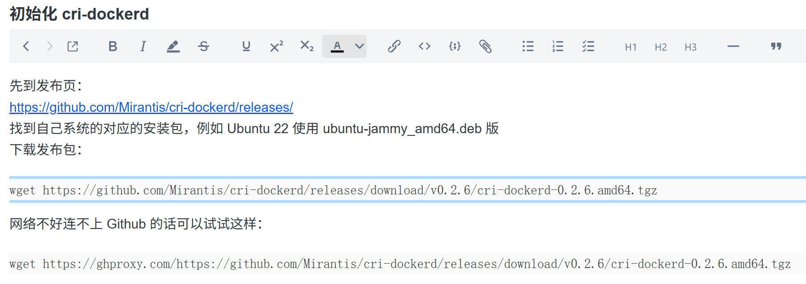

如图所示，这是我的一篇笔记在 Windows 下显示的效果，可以看出默认的代码块字体居然是宋体，而且代码块的渲染似乎也有问题；其实，换成 macOS 版也一样存在这些问题，而 macOS 的默认字体比较好看，可能比 Windows 看上去要好些。
Joplin 更新了无数次，却一直没有解决这些问题，原因不得而知。

<br />

好在 Joplin 提供了自定义样式的功能，我们来把它改的更好一些：

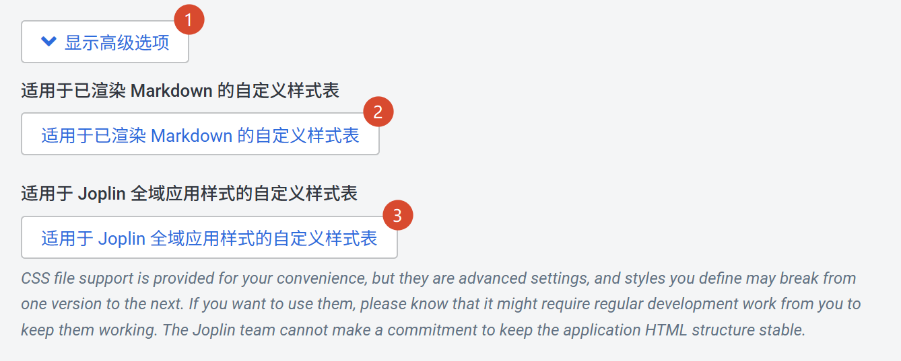

在设置界面侧边栏 “外观” → “显示高级选项” 界面中，点击第一个 “适用于已渲染 Markdown 的自定义样式表” 按钮；
此时会打开一个 CSS 文件，填入：

```css
/* For styling the rendered Markdown */
code {
  font-family: <你的代码专用字体>, Consolas, Microsoft YaHei, 'Courier New', monospace !important;
}
pre.hljs {
  padding: 0.2em 0.5em !important;
}
.mce-content-body .joplin-editable {
  margin: 0 0.25em !important;
}
```

我在代码中预留了一个填写代码专用字体的位置，你可以按需修改；或者，删去这部分，使用系统内置的 `Consolas` 字体也不错。

保存此文件，我们继续；
点击第二个 “适用于 Joplin 全域应用样式的自定义样式表” 按钮，这也会打开一个 CSS 文件，填入：

```css
/* For styling the entire Joplin app (except the rendered Markdown, which is defined in `userstyle.css`) */
.CodeMirror.CodeMirror * {
  font-family: <你的代码专用字体>, Consolas, Microsoft YaHei, 'Courier New', monospace !important;
}
.CodeMirror pre.CodeMirror-line, .CodeMirror pre.CodeMirror-line-like {
  padding-left: 0.5em !important;
  padding-right: 0.5em !important;
}
```

同理，代码字体可以改成你喜欢用的，如果没有，则删去这部分。

修改完成后，需要重新启动 Joplin；注意 Joplin 会在后台驻留，Windows 用户可以在任务栏小图标区域找到它并退出，macOS 用户直接通过快捷键退出即可。

---

经过这样的定制，编辑器中不再会显示宋体字，且代码块也不再会有遮挡问题。
定制后的样式如下图：

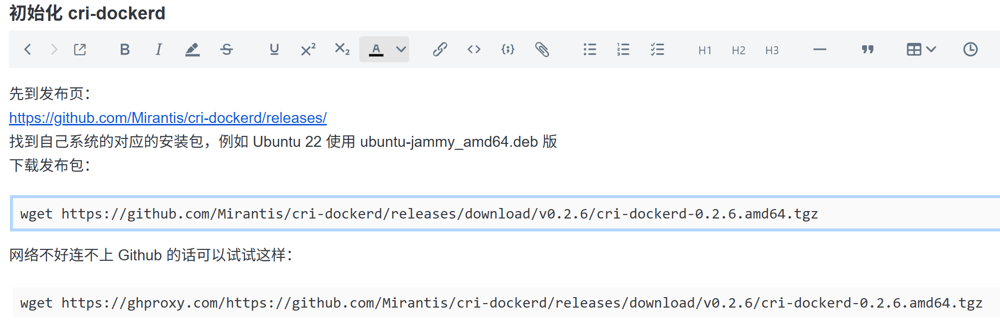

这才是正确的样式。

# 开始使用 Joplin

下面简单介绍 Joplin 的一些特色和注意点。

## 特色功能

Joplin 的文档组织方式类似于 Office OneNote，使用 “笔记本” 来对笔记进行分组；
笔记本中可以创建 “笔记” 或者 “代办”，两者都是 Markdown 格式的笔记，但 “代办” 可以设置提醒，同时还会在标题前面显示一个复选框，用户随时可以打勾并自动将这个项目置于底部。

Joplin 作为开源社区持续维护的笔记软件，它有一些颇具特色的独特功能：

- 可以在文档界面底部给笔记添加标签，此后侧边栏中就可以通过标签快速筛选笔记；
- 右上角菜单中，可查看笔记的历史版本并回溯到其中某个版本，这个功能和保存的最大历史记录可在设置里的 “笔记历史” 页面管理；
- 右上角菜单中，可以看到 Joplin 会记录笔记创建时的经纬度坐标，这个功能可在设置里的 “笔记” 页面关闭；
- 笔记中，可以嵌入 PDF 甚至视频；Joplin 集成了 OCR，可以自动扫描提取 PDF 中的文字。

## Markdown 功能

Joplin 提供三种视图：

- 预览视图；
- Markdown 原文 + 双栏模式，同时显示预览视图；
- Markdown 原文，关闭双栏模式。

在 Markdown 原文模式和预览视图之间切换，需要点击编辑器右上角的切换开关；切换到 Markdown 原文后，在它上方的 “双栏” 图标的按钮变成可用状态，通过它来切换是否同时展示预览视图。
不得不说，这个逻辑有点绕；实际使用时，推荐一直保持在 Markdown 原文模式。

同时，Markdown 原文模式下，默认也会渲染为预览视图的样子。
例如，使用 `**加粗**` 语法的文本内容，内容也会被加粗，且默认是不显示 `**` 符号的，只有光标点击后才能完整显示 `**` 标记。

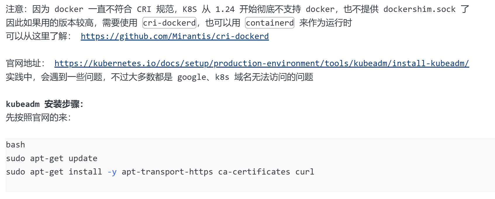

光标点击后，才会显示出 Markdown 标记：

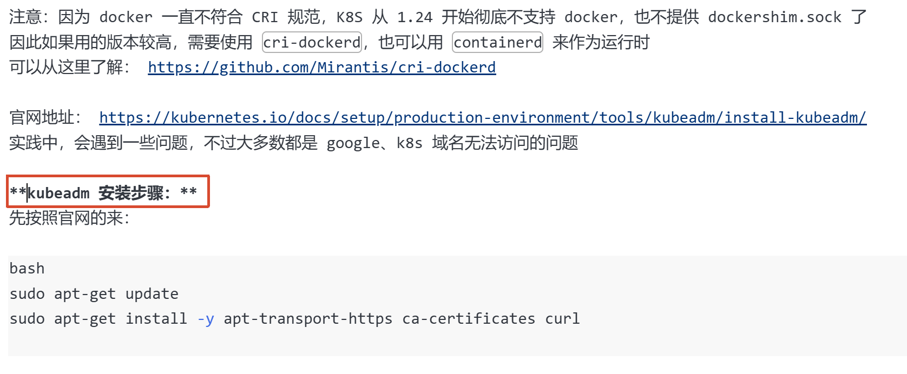

**明明是 Markdown 原文模式，却还是显示成预览模式的样式，且默认不显示 Markdown 标记，这非常反直觉，强烈建议关闭。**

前往设置界面，在侧边栏选择 “编辑器” 页面，找到 “Markdown 编辑器：在编辑器中渲染标记” 这一项，取消掉勾选，并点击应用即可。
此后，Markdown 原文模式便可以正确显示标记：

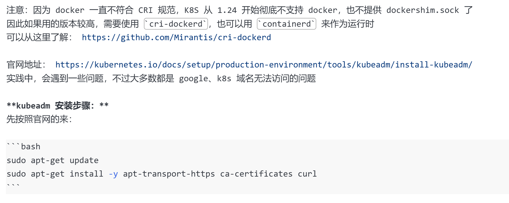

---

此外，考虑到 Markdown 的规则较为开放，没有真正意义上的 “官方规则”，因此派生出不同的特殊语法，有些语法已经被广泛接受，成为 “共识”；
Joplin 对这些语法和特性提供了较为广泛的支持，且提供了一系列开关，可以按需选用。

在设置界面的 “Markdown” 侧边栏项中，可以进入这个页面。


如果你是普通用户，一般用不太到特殊语法，那么这个设置基本上可以保持默认，**唯独考虑修改的是第一项：“启用软换行”，我建议把它开启。**

这是因为，默认情况下 Markdown 的单个换行符不会真的换行，在 GitHub 上写过 README.md 应该对这一点很熟悉，正确的换行方式要么是先两个空格然后接上换行符（这叫 “硬换行”），要么是直接插入一个空行（这是 “开启新段落”），要么是插入一个 `<br />`；
如果开启了 “启用软换行”，那么单个换行符也当作换行；这个功能很方便，我推荐启用。

# 特色功能：生成分享页

选择某一个笔记，右键菜单 → “发布笔记...” → “复制共享链接”，即可生成笔记的 Web 分享页面；
此页面是公开的，任何人都可访问。

例如，我针对一篇老笔记生成共享链接：https://joplin.paperplane.cc/shares/5K2D2tN75yOOrSGwiPcvS5
可以点击打开页面查看，这个共享页面不会暴露其它额外信息。

<br />

已共享的笔记，在列表中会以橙色显示名称，用来提醒用户这是公开笔记；
右键菜单 → “发布笔记...”，点击气泡图标，可以关闭共享：


关闭共享后，之前的链接失效；且每次共享都会重新生成链接。

---

Joplin 同样有共享笔记本的功能，但是这个功能仅针对其它注册用户，而且这个功能设计的目的是 “邀请某个用户共同参与编辑”，而不是设计为对外共享文章。

# 特色功能：网页剪藏

印象笔记曾经有一个非常受欢迎的 “剪藏” 功能，通过浏览器扩展，可以快速保存某个网页内容；
Joplin 现在也提供同样的功能。

启用方式：

1. 首先在设置页面进入 “网页剪藏器” 页面，然后点击 “启用网页剪藏器” 按钮，开启服务；
2. 然后，点击界面上的浏览器扩展市场，前往安装浏览器扩展；
3. 安装好浏览器扩展后，找到并点击它，此时应该会提示 “需要授权” 的英语；
4. 回到 Joplin，会弹出如下图所示弹窗，点击批准即可。


批准后，浏览器扩展可以连接到本机的 Joplin，此时扩展的界面就会显示一系列操作按钮，如下图：

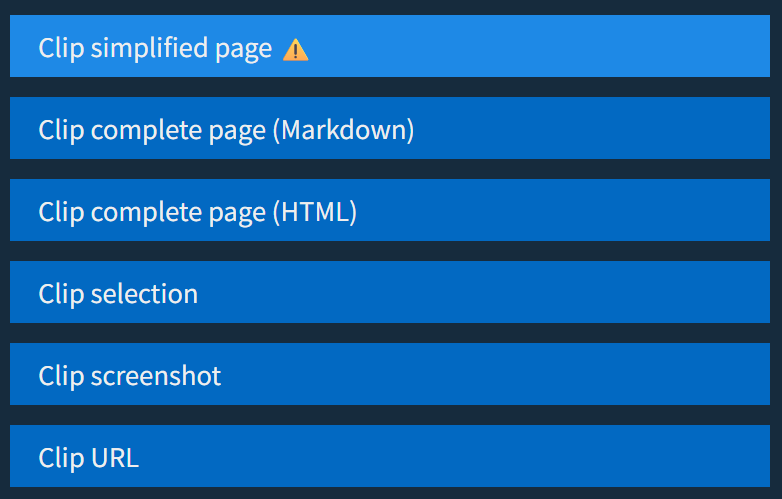

可见这里可以直接保存页面、保存 Markdown 格式、保存 HTML 格式、保存截屏等多种方式；
保存时，还可以指定保存到的笔记本，以及直接添加标签。

# 特色功能：扩展插件

作为开源产品，Joplin 的扩展性是一个极大的优势；软件不仅支持安装插件，还有着丰富插件生态以及官方支持的插件市场。

从设置界面进入到 “插件” 页面，可以看到有两个预装的插件： “Backup” 备份插件，以及 “Freehand Drawing” 画板插件。

> 备份插件在设置菜单中添加了 “Backup” 选项页，可以定时自动备份我们的笔记，默认开启即可；
> 而画板插件我觉得用处不大，建议关闭。

可以从插件页面的菜单，直接前往插件市场：

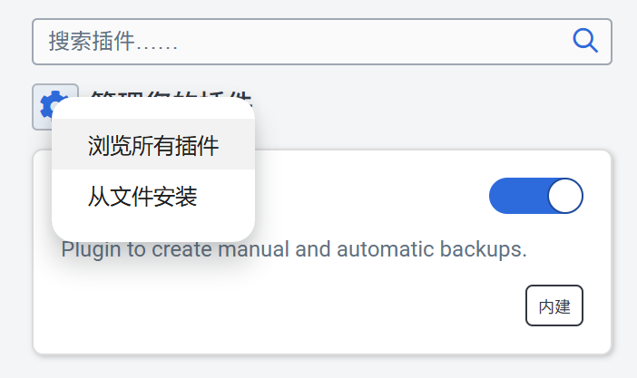

也可以直接访问网址 https://joplinapp.org/plugins/ 来浏览插件。

---

Joplin 网页版可以浏览插件的文档，但无法直接安装，只能通过在网页上下载 `.jpl` 后缀的插件文件导入 Joplin，非常不方便。
所以，我建议网页仅用来浏览插件，安装还是通过 Joplin 设置界面的 “插件” 页面上面的搜索框，输入要安装的插件，此时便可以直接安装，如下图：

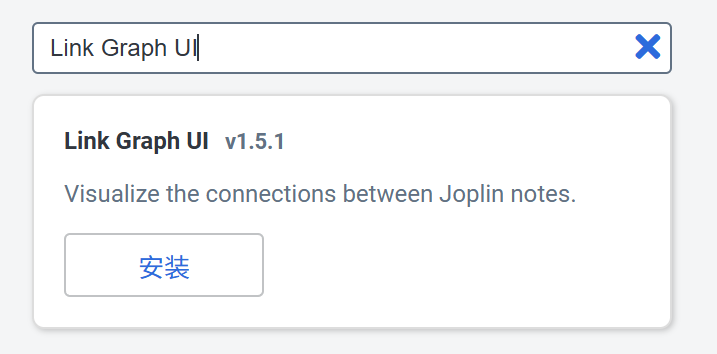

安装插件后，需要点击 “立即重启”。

---

以下是一些插件推荐。

## Better Code Blocks 更好的代码块

插件名称：`Better Code Blocks`
插件介绍页面： https://joplinapp.org/plugins/plugin/com.ckant.joplin-plugin-better-code-blocks/
GitHub： https://github.com/ckant/joplin-plugin-better-code-blocks

我认为这是一个必装的插件。

Joplin 原生的代码块并不好用，在预览模式下，代码块必须双击打开弹窗编写；在 Markdown 原文编辑模式下，打出 ` ``` ` 时，还必须手动输入代码块的语言名称，非常不方便。
这个插件正是为了解决以上问题，它还有一些其它优化，例如在代码块中全选只能选中代码块，不会选中全文。

不过，它会修改 Markdown 原文模式下代码块的样式，我建议在设置界面关掉它的 “Rendering” 功能。

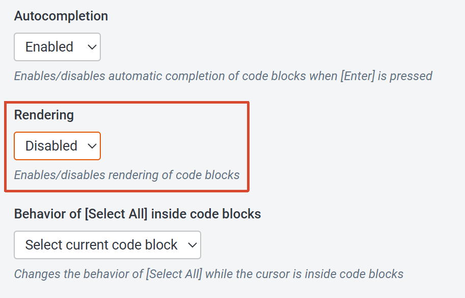

## Link Graph UI 图示化笔记链接网络

插件名称：`Link Graph UI`
插件介绍页面： https://joplinapp.org/plugins/plugin/io.treymo.LinkGraph/
GitHub： https://github.com/treymo/joplin-link-graph

Joplin 笔记的右键菜单可以选择 “复制 Markdown 链接”，此时会复制一个只能在 Joplin 内部使用的引用链接；
如果多篇笔记之间，互相引用，并使用这个链接，那么此插件便会很有用。

安装插件后，界面右上角会多出一个树形图标，点击后即可显示图示化的笔记链接网络。

## Better Tables 更好的表格

插件名称：`Better Tables`
插件介绍页面： https://joplinapp.org/plugins/plugin/com.ckant.joplin-plugin-better-tables/
GitHub： https://github.com/ckant/joplin-plugin-better-tables

这是一个完全为表格服务的插件。
在 Markdown 原文编辑器模式下，输入 `|` 即可触发表格补全，创建表格后，显示的不是由 `|` 和 `-` 组成的符号表格，而是由 CSS 渲染的真实的表格；而且这个表格的单元格还可以被框选，行和列可以被光标点选、拖拽、排序、删除，就像是 Excel 一样操作。

# 进阶：邮件配置

Joplin 支持账号系统，且可以给注册用户发送确认邮件，还支持 “忘记密码” 功能。

如果你有邮件服务器，那么可以在部署 Joplin 时进行配置。
以下是带有邮件配置的 `docker-compose.yml` 配置：

```yaml
services:
  joplin:
    container_name: joplin
    image: joplin/server:latest
    restart: unless-stopped
    environment:
      # ...
      - MAILER_ENABLED=true
      - MAILER_HOST=smtp.example.com
      - MAILER_PORT=465
      - MAILER_SECURE=true
      - MAILER_AUTH_USER=notice@example.com
      - MAILER_AUTH_PASSWORD=password123123123
      - MAILER_NOREPLY_NAME=notice
      - MAILER_NOREPLY_EMAIL=notice@example.com
```

配置完成后，便可以使用完整功能的账号系统。
请确保云服务器的 `465` 端口可以对外连接，因为很多云服务商是默认关闭的，需要提交工单。
