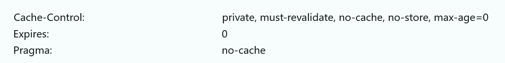
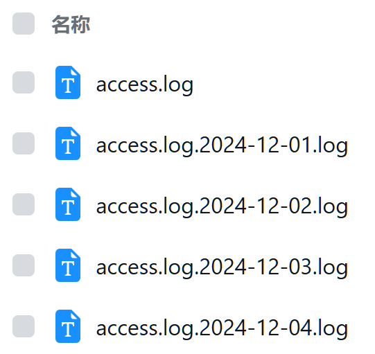
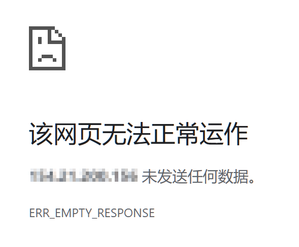

在之前的 [《Nginx 配置模板与解读》](https://paperplane.cc/post/nginx) 中，有提到 Nginx 常用的配置。那篇博文主要列出常用的配置项，以实现基础需求和备忘为主，本文则尝试利用 Nginx 更多的功能，实现进阶的需求。

# 通用配置抽离

利用 Nginx 的 `include` 语法，可以将多个地方通用的代码抽离出来。

可以参考我的做法：
首先，在和 `nginx.conf` 文件同级的位置，创建一个 `shared` 目录：

```bash
mkdir shared
```

可以把通用的配置放在这里面，例如文件 `example.conf`，其他文件这样来引入它：

```nginx
include shared/example.conf;
```

这一行语句就像是将配置文件内的代码原样搬到 `include` 的地方一样。

接下来介绍常用的几种通用配置。

## 配置 HTTPS 的 443 端口

这段配置使用安全的 TLS 配置对外暴露 443 端口，便于通过 HTTPS 访问。
为了优化性能和体验，配置默认使用 HTTP2；为了安全性，还开启了 HSTS 和 OCSP 装订。

文件名：`ssl.conf`，引入语句：`include shared/ssl.conf;`
配置片段：

```nginx
listen 443 ssl;
listen [::]:443 ssl;
http2 on;

# 如果网站有多个域名，需要不同的证书，那下面这两行可以不放在这里
ssl_certificate /path-to-your/fullchain.pem;
ssl_certificate_key /path-to-your/key.pem;

ssl_ciphers EECDH+CHACHA20:EECDH+CHACHA20-draft:EECDH+AES128:RSA+AES128:EECDH+AES256:RSA+AES256:EECDH+3DES:RSA+3DES:!MD5;
ssl_protocols TLSv1 TLSv1.1 TLSv1.2;
ssl_stapling on;
ssl_stapling_verify on;

add_header Strict-Transport-Security "max-age=31536000; includeSubDomains; preload";
```

示例使用方式：

```nginx
server {
  server_name example.com;

  include shared/ssl.conf;
}
```

如果网站只使用一个域名，像上面例子一样把 `ssl_certificate` 相关的配置也放在 `ssl.conf` 里面。

注意，这里配置了 HSTS，也就是说浏览器会认为你的网站 “只支持 HTTPS”，任何 HTTP 请求会被浏览器拒绝。

## proxy_pass 通用配置

将请求路由到服务时，一般也需要配置几个头，所以可以把这几段抽离出来方便使用。

文件名：`proxy.conf`，引入语句：`include shared/proxy.conf;`
配置片段：

```nginx
proxy_set_header Host $host;
proxy_set_header X-Real-IP $remote_addr;
proxy_set_header X-Forwarded-For $proxy_add_x_forwarded_for;
proxy_set_header X-Forwarded-Proto $scheme;
```

如果你想要所有 `proxy_pass` 都支持 WebSocket，也可以把以下两行也加进去：

```nginx
proxy_set_header Upgrade $http_upgrade;
proxy_set_header Connection "upgrade";
```

示例使用方式：

```nginx
location / {
  proxy_pass http://localhost:8888;

  include shared/proxy.conf;
}
```

这样就避免了配置条目的冗余。

## 禁用 `index.html` 的缓存

SPA 网站，编译后静态部署，需要禁用 `index.html` 的缓存。
本段配置基于之前那篇 [博文](https://paperplane.cc/post/nginx)，禁用缓存配置参考了知乎、腾讯云等网站的首页响应头。

文件名：`nocache.conf`，引入语句：`include shared/nocache.conf;`
配置片段：

```nginx
add_header Cache-Control "private, no-cache, no-store, max-age=0";
add_header Pragma "no-cache";
add_header Expires "0";
```

示例使用方式：

```nginx
location /subpath/ {
  alias /path-to-index-html/;
  try_files $uri @website-name;
  index index.html;
}

location @website-name {
  root /path-to-index-html/;
  try_files /index.html =404;

  include shared/nocache.conf;
}
```

顺带贴出知乎使用的响应头：



## robots.txt 配置

`robots.txt` 用于限制爬虫的行为，一般我们的源代码管理、内网管理入口等都不希望被爬虫访问，此时可以将这部分配置抽离出来作为公共部分，方便在各处使用。

在 `shared` 同级目录创建一个 `robots` 目录，新建 `disallow-all.txt` 文件，用于禁用所有机器人；
配置如下：

```ini
User-agent: *
Disallow: /
```

然后，在 `shared` 下创建文件 `disallow-robots.conf`，填入内容：

```nginx
alias /etc/nginx/robots/disallow-all.txt;
# 注意这里的路径按照你服务器上实际文件路径来填，仅作为示例
```

这样即可。

此后，对于有需求禁用爬虫的网站，可以这样使用：

```nginx
location /robots.txt {
  include shared/disallow-robots.conf;
}
```

# Cloudflare 代理配置

如果你的网站使用 Cloudflare 代理，那么用户的请求将经过 Cloudflare 的网关转发到服务器，此时 Nginx 的客户端 IP 将不再正确，需要特别配置。

需要注意的点如下：

- Cloudflare 会处理请求，将用户真实访问 IP 作为 `CF-Connecting-IP`、`CF-Connecting-IPv6` 请求头，此外还会带有一些 `CF-` 开头的额外的请求头，具体可以参考 [Cloudflare 官方文档](https://developers.cloudflare.com/fundamentals/reference/http-headers/)；
- Cloudflare 向用户服务器请求的网关的 IP 地址是固定的，可以在 [Cloudflare IP 段页面](https://www.cloudflare.com/ips/) 找到所有 IP 段。

因此，我们可以指定针对 **来自 Cloudflare IP 段的请求** 进行信任，并进行特殊处理。
以下给出配置：

```nginx
set_real_ip_from 173.245.48.0/20;
set_real_ip_from 103.21.244.0/22;
set_real_ip_from 103.22.200.0/22;
set_real_ip_from 103.31.4.0/22;
set_real_ip_from 141.101.64.0/18;
set_real_ip_from 108.162.192.0/18;
set_real_ip_from 190.93.240.0/20;
set_real_ip_from 188.114.96.0/20;
set_real_ip_from 197.234.240.0/22;
set_real_ip_from 198.41.128.0/17;
set_real_ip_from 162.158.0.0/15;
set_real_ip_from 104.16.0.0/13;
set_real_ip_from 104.24.0.0/14;
set_real_ip_from 172.64.0.0/13;
set_real_ip_from 131.0.72.0/22;

set_real_ip_from 2400:cb00::/32;
set_real_ip_from 2606:4700::/32;
set_real_ip_from 2803:f800::/32;
set_real_ip_from 2405:b500::/32;
set_real_ip_from 2405:8100::/32;
set_real_ip_from 2a06:98c0::/29;
set_real_ip_from 2c0f:f248::/32;

real_ip_header CF-Connecting-IP;
real_ip_recursive on;
```

此配置针对 Cloudflare IP 段的访问，信任其 `CF-Connecting-IP` 作为真实 IP。

---

如果使用 `fail2ban`，还可以将这些 IP 作为忽略的 IP，配置如下：

```ini
[DEFAULT]
# 其它配置 ...
ignoreip  = 127.0.0.1 \
            173.245.48.0/20 103.21.244.0/22 103.22.200.0/22 103.31.4.0/22 \
            141.101.64.0/18 108.162.192.0/18 190.93.240.0/20 188.114.96.0/20 \
            197.234.240.0/22 198.41.128.0/17 162.158.0.0/15 104.16.0.0/13 \
            104.24.0.0/14 172.64.0.0/13 131.0.72.0/22 \
            2400:cb00::/32 2606:4700::/32 2803:f800::/32 2405:b500::/32 \
            2405:8100::/32 2a06:98c0::/29 2c0f:f248::/32
```

# 日志管理

Nginx 运行时会记录所有访问，并存储为日志：
正常访问日志：`/var/log/nginx/access.log`
错误访问日志：`/var/log/nginx/error.log`

如果 Nginx 运行于 Docker 中，还能通过 `docker logs nginx` 来查看日志。

这就引发一个问题：Nginx 很可能一启动就是运行几个月甚至一年时间，日志非常长，不方便定位问题，我们需要一种方式来管理 Nginx 的日志。

## 日志分段管理

常见的 Linux 发行版中，一般都会预装 [`logrotate`](https://github.com/logrotate/logrotate) 这个日志管理工具，Linux 系统内部的各种日志也都是由它来管理的。

`logrotate` 可按照特定时间周期，对日志进行 “轮转”，其实就是切分并按照序号或者日期重命名，对于旧的日志甚至还能自动压缩存储。

你可以执行以下指令查看系统日志：

```bash
cd /var/log
ls -l
```

体验一下这个工具对日志的管理能力。

---

本文介绍通过系统内置的 `logrotate` 和通过 Docker 安装 `logrotate` 两种配置方式。
以下先介绍系统内置的 `logrotate`：

Linux 系统自带的 `logrotate` 的配置文件位于 `/etc/logrotate.d` 目录下。
来到这个目录，可以看到有一些系统预设的日志管理，我们新建一个 `nginx` 文件，并填入以下内容：

```
/var/log/nginx/access.log /var/log/nginx/error.log {
  daily
  rotate 30
  dateext
  dateformat .%Y-%m-%d.log
  missingok
  create 644 root root
  postrotate
    nginx -s reopen
  endscript
}
```

上面的路径请换成你 Nginx 日志的路径，默认是 `/var/log/nginx`。

如果 Nginx 安装在 Docker 里，则需要把日志目录挂载到宿主机，这里的目录路径也要对应修改；
而且，上述的 `nginx -s reopen` 需要相应改为 `docker exec nginx nginx -s reopen`。

简单解释一下这段配置的作用：

- `daily` 表示是每日运行的，还可以配置成按周、按月等方式；
- `rotate 30` 表示存储多少份，这里配置 `30` 就是说一个月之前的日志就被删掉了；
- `dateext` 表示启用日期扩展名，`dateformat .%Y-%m-%d.log` 是对往期日志的重命名格式，前一天以及更早的日志，会被分割成单独的文件，并按照这个格式命名，参考下图；<br />如果不启用日期扩展名，那么后缀就是 `.1`、`.2` 这种格式了；
- `missingok` 表示日志不存在时不报错，继续执行；
- `postrotate` 和 `endscript` 之间的语句，会在每次执行完日志处理后运行，这里提供一个重新打开日志文件的指令给 Nginx，而不用重启服务。

正确配置后，从次日开始，你就可以看到 Nginx 日志像这样被分段存储了：



上述提供的配置，会在文件名最后再追加一个 `.log` 尾缀，方便工具快速预览。

此外，`logrotate` 还可以对往期日志进行压缩，使用 `compress` 配置可以使往期日志自动压缩成 `.gz` 格式，使用 `delaycompress` 配置则表示延迟压缩，对最近处理的日志文件暂不压缩。

> 你可能对 `logrotate` 的这个 `daily` 有疑惑，它到底是每天的几点钟运行？
>
> 实际上，`logrotate` 的 `daily`、`weekly`、`monthly` 也都是利用 Linux 自身 `crontab` 定时任务来触发的，例如 `/etc/cron.daily/logrotate` 文件就是每日运行的启动脚本；
> 而 `crontab` 执行 `daily` 任务的确切时间，可以通过 `cat /etc/crontab` 来查看，对于 Ubuntu 发行版而言，这个时间是 6:25 AM，对于 Alpine 系统而言，这个时间是 2:00 AM。

---

下面是通过 Docker 使用 `logrotate` 的方式：

目前没有官方性质的 `logrotate` 镜像，可以使用由我开发的 [`chiskat/docker-logrotate`](https://hub.docker.com/r/chiskat/docker-logrotate) 镜像，它基于 Alpine，预装了 `logrotate` 和 `docker-cli`，且提供了丰富的配置项。

使用 `docker-compose.yml` 来配置：

```yml
volumes:
  logrotate-state:

services:
  nginx:
    image: nginx
    volumes:
      - ./logs:/var/log/nginx
    # ...
    # 其它 Nginx 配置此处省略

  logrotate:
    image: chiskat/docker-logrotate:latest
    restart: unless-stopped
    volumes:
      - ./logs/:/logs/
      - ./logrotate.d/:/etc/logrotate.d/
      # ↓ 可选，挂载自定义主配置文件（不挂载时使用默认值）
      # - ./logrotate.conf:/etc/logrotate.conf:ro
      # ↓ 请确保容器内的 /var/lib/logrotate 被持久化
      - logrotate-state:/var/lib/logrotate/
      # ↓ 如果需要用到 docker cli 操作宿主机的其它容器，则添加下方这一行
      - /var/run/docker.sock:/var/run/docker.sock
```

只需要把上文中的 `/etc/logrotate.d/nginx` 配置文件挂载到 `./logrotate.d/nginx`，然后把 Nginx 的日志目录挂载到容器中的 `/logs/` 即可；
此外还可以定制每次运行 `logrotate` 的时间，可通过 `LOGROTATE_CRON` 环境变量自定义 `logrotate` 运行的 CRON。

这个镜像还预装了 Docker CLI，只要挂载 `/var/run/docker.sock` 到镜像内，便可以通过 `docker exec ...` 或 `docker restart ...` 等命令调度其它容器运行；如果 Nginx 等其它服务也使用 Docker 运行，那么此功能将非常有用。

## Docker 打印和存储日志

在 Docker 中运行 Nginx 时，需要把容器中的 `/var/log/nginx/` 挂载出来，便于持久化保留日志。
如果挂载出日志目录后，`docker logs nginx` 不再能打印日志输出，那么可以这样修改 `nginx.conf`：

```nginx {2,4}
access_log /var/log/nginx/access.log main;
access_log /dev/stdout main;
error_log  /var/log/nginx/error.log warn;
error_log  /dev/stderr warn;
```

添加两行配置，将输出写入到 `/dev/stdout` 和 `/dev/stderr` 即可。

## 日志格式优化

::: warning 不推荐这么做
这种方式可以把日志改的很易于阅读，但会导致 `fail2ban` 等依托于 Nginx 的工具无法识别日志内容，从而无法正确封锁 IP。
:::

编辑 `/etc/nginx/nginx.conf`，可以找到这样一段内容：

```nginx
log_format main
  '$remote_addr - $remote_user [$time_local] "$request" '
  '$status $body_bytes_sent "$http_referer" '
  '"$http_user_agent" "$http_x_forwarded_for"';

access_log /var/log/nginx/access.log main;
```

这就是 Nginx 主日志的格式和存储文件位置。日志格式中各个占位符的定义，建议参考 Nginx [官方文档](https://nginx.org/en/docs/http/ngx_http_log_module.html)。

这里提供一个我曾经使用过的日志格式，你可以根据需求调整并选用：

```nginx
log_format main
  '时间:[$time_local] 来自:[$remote_addr] 状态:[$status] 域名:[$host] 路径:[$request] 引荐:[$http_referer] '
  'UA:[$http_user_agent] 转发:[$http_x_forwarded_for]';
```

# 内置特殊状态码

有的网站，打开后会显示成这样：



一般可能认为是网站挂掉了，或是服务器处于离线状态。

实际上还真不一定，因为 Nginx 也能实现这种效果，而且配置非常简单：

```nginx
return 444;
```

只需要返回 `444` 这个状态码，浏览器访问时就会提示 “未发送任何数据”；
这里的 `444` 状态码并不是标准的 HTTP 状态码，它是 Nginx 内部使用的一个标识，表示不回应客户端发送的数据，这会直接中断连接。

如果你的网站使用负载均衡，或其他措施避免暴露真实 IP，此时你应该这样配置 Nginx：

```nginx {2,7}
server {
  server_name _;

  listen 80 default_server;
  listen [::]:80 default_server;

  return 444;
}
```

这样对于通过 IP 访问的请求，Nginx 会拒绝回应，避免真实 IP 被网上各种批量扫描发现；
如果返回 `403`、`502` 等状态码，可能会被标记为 Web 服务器，引来后续攻击，直接拒绝回应是最好的做法。

<br />

Nginx 内部存在着多个这种状态码，可以 [点击链接](https://redirect.li/http/status/nginx/) 查询；
不过，我们能在配置文件中使用的，应该就只有 `444` 这一个，其他的状态码都是 Nginx 遇到特殊情况记录在日志中，向用户反馈特殊请求场合的。

# 扩展知识：隐藏版本号

Nginx 会在响应头中加上 `Server: nginx/<版本号>` 这个信息，这个头无法去除，这可能会导致暴露我们的 Nginx 版本，从而引发安全问题。

编辑 `nginx.conf`，添加以下内容：

```nginx {3}
http {
  # ...
  server_tokens off;
  # ...
}
```

这样就可以消除 Nginx 版本号了，但是这个响应头还是无法直接去除的。
