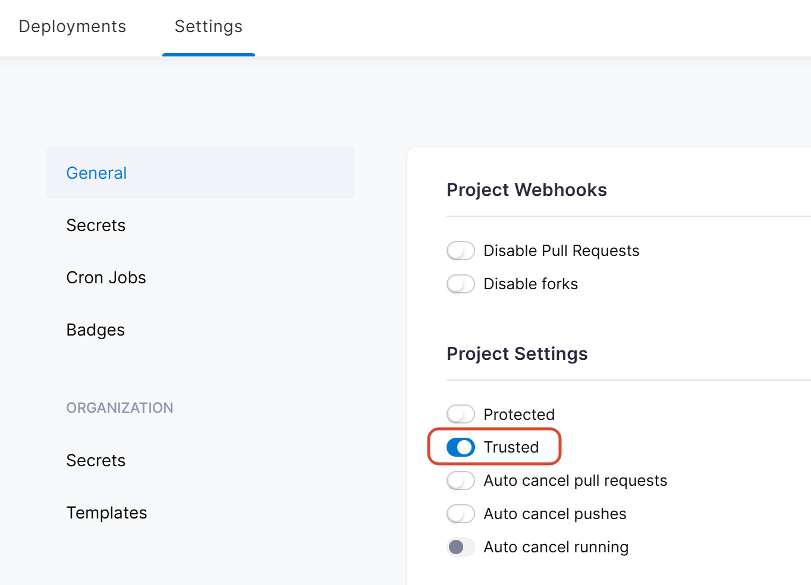
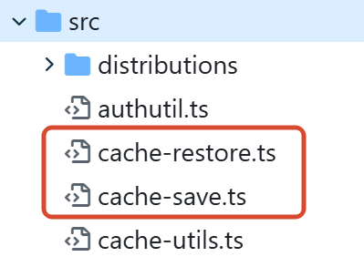
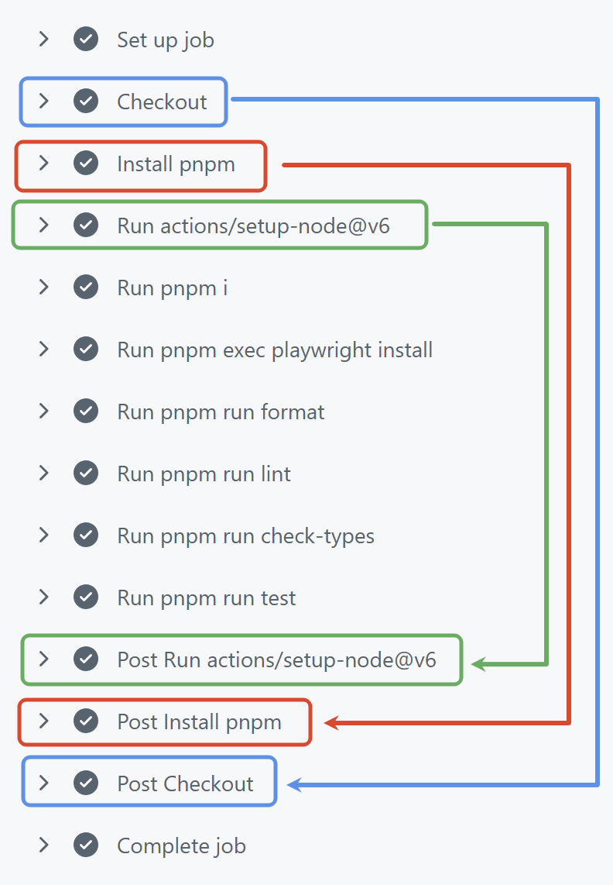
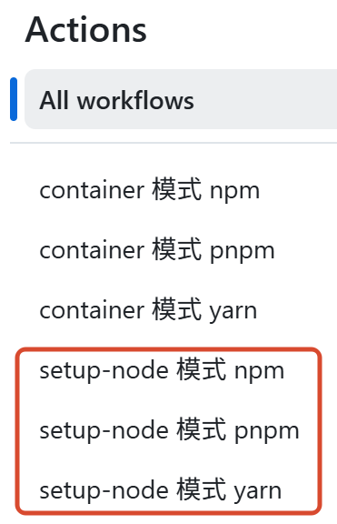
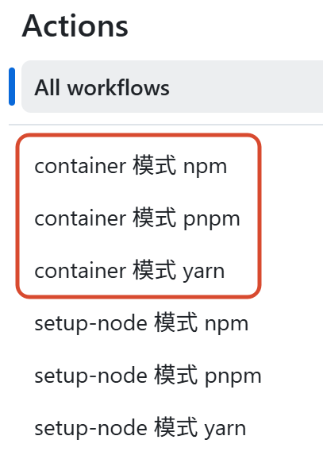

执行 CI/CD 时，通常我们希望加快 `npm i` 步骤的执行速度，因为很多项目的依赖较多，下载这一步往往会比较耗时。

包管理工具，往往会提供 “本地缓存”，每个包第一次下载之后，文件会在这里存储，后续**同版本**的包如果再次被安装，则直接从这里复制文件；
所以，CI/CD 过程中，将包管理工具的 “本地缓存” 目录持久化，是一个加快 `npm i` 的不错的优化手段。

本文旨在探索 npm、yarn、pnpm（尤其是 pnpm） 这些工具运行在 Drone CI、GitHub Actions 等环境下时，相对应的缓存持久化方式。

# 包管理工具的缓存

本文不考虑 Windows 和 macOS 环境，只考虑 CI/CD 场景常用的操作系统，例如 Ubuntu、Alpine、Node 镜像。

## npm 的缓存

可通过以下命令查找 npm 的缓存目录：

```bash
npm config get cache
```

想验证 `node` 镜像中的缓存目录，可以使用命令：

```bash
docker run --rm node:22 npm config get cache
```

npm 的缓存目录位于 `~/.npm` 目录；
在 `node` 镜像中，默认用户是 `root`，因此，缓存目录为：

```
/root/.npm
```

将此目录持久化，后续 `npm i` 的步骤便可以得到提速。

> 可以通过 `docker run --rm node:20-alpine whoami` 来验证当前用户。

---

可以通过以下方式来覆写这个缓存目录：

- 命令 `npm config set cache 缓存目录` 永久设置；
- 执行安装等命令时，添加 `--cache 缓存目录` 参数，一次性设置；
- 环境变量 `npm_config_cache`，例如在制作 Docker 镜像时可以用这种方式；
- 在 `.npmrc` 中设置 `cache=缓存目录`，这样可以跟随项目代码一起持久化。

## yarn 的缓存

可通过以下命令查找 yarn 的缓存目录：

```bash
yarn cache dir
```

想验证 `node` 镜像中的缓存目录，可以使用命令：

```bash
docker run --rm node:22 yarn cache dir
```

yarn 的缓存目录会根据用户产生区别：

- `root` 用户：`/usr/local/share/.cache/yarn`
- 普通用户：`~/.cache/yarn`

如果使用 `node` 镜像，默认是 `root` 用户，那么就是上面的第一项；
将此目录持久化，后续 `yarn` 安装的步骤便可以得到提速。

---

[官网文档](https://classic.yarnpkg.com/lang/en/docs/cli/cache/#toc-yarn-cache-dir) 中提到，可以通过一些方式覆写此目录：

- 命令 `yarn config set cache-folder 缓存目录`，永久设置；
- 执行安装等命令时，添加 `--cache-folder 缓存目录` 参数，一次性设置；
- 环境变量 `YARN_CACHE_FOLDER`，例如在制作 Docker 镜像时可以用这种方式。

## 与众不同的 pnpm 的缓存

pnpm 存在两个 “缓存” 概念：

- `cache-dir`：网络缓存、元数据等，它虽然也是缓存，但并不重要，本文不考虑它；
- `store-dir`：pnpm 的全局包存储，它才是 pnpm 的核心；
  本文中，把 **能略过包下载过程的文件** 称之为缓存，而这些文件正好可以满足这个需求，符合主旨。

在 Linux 系统下，pnpm 的原理是：

- 为了避免幽灵依赖，`node_modules` 目录下只会有 `package.json` 中的依赖项，而且这些都不是真实的文件，而是 **符号链接**，指向 `node_modules/.pnpm` 目录中的文件；
- 在 `node_modules/.pnpm` 目录下存放着依赖项的真实文件，但这些文件是从 pnpm 的统一存储 `store-dir` 目录中 **硬链接** 出来的。

> 硬链接是 Linux 的一种特殊的 “快捷方式”，你可以理解成可以给同一个文件设置多个路径名称，这个文件可以被从多个路径名称来访问、修改；虽然能从多个路径来访问，但它本质上还是同一个文件，只占用一份存储容量。
>
> 同样地，当硬链接被删除时，只是取消了这一个路径名；当某个文件的所有路径名都被取消，这个文件才真被删除了。

这也是 pnpm 高性能的核心原理。因为这样一来，每个项目安装依赖时，如果本地缓存有对应版本的包，直接创建链接即可，连复制文件都免去了，还能节省磁盘占用。

---

可以通过以下命令获取 pnpm 的 `store-dir` 缓存目录：

```bash
pnpm store path
```

想验证 `node` 镜像中的缓存目录，可以使用命令（需稍作等待）：

```bash
docker run --rm node:22 sh -c "corepack enable pnpm && corepack prepare pnpm --activate && pnpm store path"
```

pnpm 的默认缓存目录是这样的：

- 默认情况下位于 `PNPM_HOME` 环境变量下的 `store` 目录，也就是 `~/.local/share/pnpm/store`；
- 早期（< 7.0.0）版本时，曾位于 `~/.pnpm-store`。

因为 `node` 镜像默认 `root` 用户，因此缓存目录是 `/root/.local/share/pnpm/store`。

---

**但是，这只是全局通用的缓存目录，真相信了它，你就错了。**

Linux 系统中，硬链接存在一个限制：**硬链接不能跨越磁盘卷。**
因此，pnpm 的缓存，存在一个回退机制：**如果预期位置无法设置缓存，pnpm 会尝试在相对 “较近” 但 “层级较高” 的位置创建缓存，尽可能避免跨越磁盘卷。**

可在 [pnpm v11 源码](https://github.com/pnpm/pnpm/blob/main/store/path/src/index.ts) 或 [v10 源码](https://github.com/pnpm/pnpm/blob/v10.34.1/store/store-path/src/index.ts) 中看到这部分逻辑：

- 使用 [`path-temp`](https://www.npmjs.com/package/path-temp) 创建临时文件，并使用 [`can-link`](https://www.npmjs.com/package/can-link) 来测试是否能建立硬链接；
- 核心函数 `getStorePath` 首先判断用户是否指定了路径：
  - 如果用户指定了相对路径或绝对路径，则计算出目录并直接使用；
  - 如果没指定，或指定了基于 `~` 的路径，则使用函数 `storePathRelativeToHome` 来测试；
- 函数 `storePathRelativeToHome` 会依次测试目录是否可建立硬链接：
  1. 初始从 `pnpmHomeDir` + `/store` 这个目录开始测试，链接成功则直接使用；
     其中 `pnpmHomeDir` 就是 `PNPM_HOME`，也就是 `~/.local/share/pnpm`，但如果用户指定了基于 `~` 的路径，则使用用户指定的路径；
  2. 如果链接失败，会使用 [`root-link-target`](https://www.npmjs.com/package/root-link-target) 查找**当前卷的挂载根节点**，如果它还有父级路径，则**优先测试此父级路径**能否硬链接，然后测试这个路径能否硬链接；
     此时，使用 `.pnpm-store` 作为目录名，而不是 `store` 了；
  3. 针对 ② 的结果，检测它是否和项目目录相同，如果相同，则回退至 ① 的结果。
- 如果所有硬链接都创建失败，则回退至 “文件复制” 的方式。

**在 CI/CD 环境下，如果工作区是通过 “卷挂载” 的方式共享给流水线步骤，这会导致硬链接无法创建，从而发生回退行为，具体取决于 CI/CD 是如何处理工作区目录的。**
总之，CI/CD 环境中，pnpm 的缓存目录极大概率**不是** `~/.local/share/pnpm/store`。

---

pnpm 同样提供了一些方法覆写缓存目录：

- 命令 `pnpm config set store-dir 缓存目录`，永久设置；
- 执行安装等命令时，添加 `--store-dir 缓存目录` 参数，一次性设置；
- 环境变量 `pnpm_config_store_dir`，例如在制作 Docker 镜像时可以用这种方式；
  （v11 之前的版本是 `npm_config_store_dir`）
- 在 `.npmrc` 中设置 `store-dir=缓存目录`，这样可以跟随项目代码一起持久化。

注意，如果无法从项目目录创建到目标目录的硬链接，pnpm 还是会回退为复制文件的方式。

# Drone CI 的缓存配置

先来讲讲 Drone CI 缓存的实现方式。

Drone CI 允许我们配置 “[卷挂载到宿主机](https://docs.drone.io/pipeline/docker/syntax/volumes/host/)”，将流水线镜像中的某目录挂载到宿主机，这样一来，即使流水线执行结束，挂载的目录仍然保留在宿主机，缓存文件得以保留，后续的 `npm i` 便可以享受到缓存的加速。

## 步骤 1/2：在 Drone 网页设置 “信任”

在 Drone CI 中，想要开启挂载卷，首先需要在 Web 界面项目的 “Settings” 设置页面的 “General” 栏，找到 “Project Settings”，打开其中的 “Trusted” 开关：



因为挂载卷需要高级权限，必须开启此项。

**注意，每个需要挂载卷的项目都需要开启此项，这个设置没有全局配置方式。**

## 步骤 2/2：配置项目中的 `.drone.yml`

然后，在 `.drone.yml` 中配置流水线步骤时，添加挂载卷的配置：

::: code-group

```yaml {1-4,11-13} [npm 的配置]
volumes:
  - name: npm-cache
    host:
      path: /path/to/host/dir # 设为服务器上的某个目录

steps:
  # ...

  - name: install-deps
    image: node:20
    volumes:
      - name: npm-cache
        path: /root/.npm
    commands:
      - npm ci

  # ...
```

```yaml {1-4,11-13} [yarn 的配置]
volumes:
  - name: yarn-cache
    host:
      path: /path/to/host/dir # 设为服务器上的某个目录

steps:
  # ...

  - name: install-deps
    image: node:20
    volumes:
      - name: yarn-cache
        path: /usr/local/share/.cache/yarn
    commands:
      - yarn install --frozen-lockfile --non-interactive

  # ...
```

```yaml {1-4,11-13} [pnpm 的配置]
volumes:
  - name: pnpm-cache
    host:
      path: /path/to/host/dir # 设为服务器上的某个目录

steps:
  # ...

  - name: install-deps
    image: chiskat/baseline-node20:2026.1.14 # 预装 pnpm
    volumes:
      - name: pnpm-cache
        path: /drone/src/.pnpm-store
    commands:
      - pnpm i # --frozen-lockfile 在 CI 环境下自动开启

  # ...
```

:::

这样就完成了配置。

注意 pnpm 的示例中，用的是我自己开发的 [chiskat/baseline-node](https://github.com/chiskat/baseline-node) 镜像，它是内置开箱即用 pnpm 的镜像，且定期同步最新版本的 node 和 pnpm，还有对应的预装 `puppeteer` 版本，在此推荐一下。

如果使用 `node` 镜像，那么需要运行 `corepack enable pnpm` 开启 pnpm 支持，这一步是需要联网下载且比较耗时的，更适合在基础镜像中固化下来，不要每次 CI/CD 期间都执行。

**这种配置，多个项目可以复用同一份缓存，只要最开始的 `volumes` 都指向相同的宿主机目录即可。**
不过不同的包管理工具之间不能混用，因为它们的缓存目录结构不同。

---

为了测试包管理工具在 Drone CI 中的行为，我创建了 [chiskat/test-package-manager-cache](https://git.paperplane.cc/chiskat/test-package-manager-cache) 这个仓库，它在 Drone CI 中运行代码和命令，打印各种信息方便我们查看。

可以在 [Drone CI](https://drone.paperplane.cc/chiskat/test-package-manager-cache) 页面，找到最近一次的 CI/CD 记录，进入查看终端输出缓存目录测试情况。

以下是测试运行的终端结果输出：

::: code-group

```plaintext {7-8,12-21} [npm]
当前用户： root

用户目录： /root

当前目录： /drone/src

执行 "npm config get cache" 的结果是：
/root/.npm

当前目录结构：（省略）

用户目录结构：
/root
├── .npm
|  ├── _cacache
|  |  ├── content-v2
|  |  |  └── sha512
|  |  |     ├── 01
|  |  |     |  └── 18
|  |  |     |     └── 42a66ef47f3...
（大量文件，此处省略）
```

```plaintext {7-8,23-31} [yarn]
当前用户： root

用户目录： /root

当前目录： /drone/src

执行 "yarn cache dir" 的结果是：
/usr/local/share/.cache/yarn/v6

当前目录结构：（省略）

用户目录结构：
/root
├── .npm
|  ├── _cacache
|  |  ├── content-v2
|  |  |  └── sha512
|  |  |     ├── 01
|  |  |     |  └── 18
|  |  |     |     └── 42a66ef47f3...
（.npm 下只有少量文件）

目录 "/usr/local/share" 的结构：
/usr/local/share
├── .cache
|  └── yarn
|     └── v6
|        ├── .tmp
|        ├── npm-@babel-code-frame-7.29.7-integrity
|        |  └── node_modules
（大量文件，此处省略）
```

```plaintext {7-8,16-22} [pnpm]
当前用户： root

用户目录： /root

当前目录： /drone/src

执行 "pnpm store path" 的结果是：
/drone/src/.pnpm-store/v10

当前目录结构：（省略）

用户目录结构：（省略，.npm 目录下只有少量文件）

目录 "/usr/local/share"： （省略，只有少量文件）

目录 "./.pnpm-store" 的结构：
/drone/src/.pnpm-store
└── v10
   ├── files
   |  ├── 00
   |  |  └── 07213771ccbfdf3b2027e0
（大量文件，此处省略）

目录 "~/.local/share" 是否存在：
false
```

:::

终端输出中，我已将对应的缓存目录高亮；
可以看出我们配置的缓存目录是正确的，对应的目录中都有大量的文件。

---

你可能会有疑问：

- pnpm 的缓存目录，为什么会是 `/drone/src/.pnpm-store`，而且 pnpm 终端输出竟说 `~/.local/share` 这个目录不存在？
- 这里的 `/drone/src` 这段路径是哪里来的？

## 关于 pnpm 缓存的特殊性

我们之前已经讲到过，pnpm 在项目目录下的依赖包文件，实际上是指向全局统一包存储处的**硬链接**；
默认的全局存储位置是 `~/.local/share/pnpm/store`。

**但是，像是 Drone 这种 CI/CD 环境下，工作区的目录往往是通过 [Docker Volume 卷挂载](https://docs.docker.com/engine/storage/volumes/) 的方式放进来的，而硬链接无法跨越磁盘卷。**

::: info 关于 “工作区”

CI/CD 中，项目代码默认被放置的目录叫做 “工作区”，命令的执行也默认从工作区开始。
Drone CI 的工作区，默认值是：

```
/drone/src
```

如果想要自定义，可以在 `.drone.yml` 中配置：

```yaml
workspace:
  path: /path/to/workspace
```

:::

在 [chiskat/test-package-manager-cache](https://git.paperplane.cc/chiskat/test-package-manager-cache) 项目中，`.drone.yml` 中还有一段 Shell 用于输出流水线镜像中的卷分布情况；我们在 [Drone CI](https://drone.paperplane.cc/chiskat/test-package-manager-cache) 的执行记录中，查看 `check-volume` 步骤的输出：

```
===== 1. /proc/mounts 中查找 /drone 相关挂载 =====
/dev/vda1 /drone/src ext4 rw,relatime,discard,errors=remount-ro 0 0
```

可以看出，工作区 `/drone/src` 本身就是一个单独的卷。

**前面提到过，pnpm 在无法建立到全局包存储的硬链接时，会回退到卷的根目录创建 `.pnpm-store`，而工作区 `/drone/src` 本身就是一个卷，因此卷的根目录就是工作区，所以，这个 `.pnpm-store` 直接被创建在了工作区目录中，和项目中的 `package.json` 等文件同级。**

<br />

所以，在 Drone CI 的流水线步骤中，pnpm 的全局包存储目录，位于工作区下的 `.pnpm-store` 目录。
使用默认工作区时，此目录为 `/drone/src/.pnpm-store`。

此时 `~/.local/share/pnpm/store` 目录甚至都不会存在，因为无法被硬链接，pnpm 甚至都不会去创建它。

## pnpm 的另一种配置方法

因为工作区单独处于一个卷内，不可能通过硬链接访问到现有的全局包存储，因此，pnpm 会回退为 “复制文件” 的行为。这个复制文件的过程，可能比较耗时，也会比较耗费 IO 性能。

有一种思路是，通过一些专用的缓存镜像，在每次安装依赖后，将 `.pnpm-store` 这个目录保存起来；在下次安装依赖前，提前恢复 `.pnpm-store` 这个目录，这个过程不会涉及到任何卷的挂载，因此不会影响 pnpm 的文件链接。
这样，密集 IO 操作便被移到流水线的其它步骤，pnpm 得以快速建立文件链接，安装这一步可以变得更快。

> 实际上，GitHub Actions 的缓存也是这个原理。

基于以上思路，我们可以换一种配置方式：

```yaml {1-4,7-15,22-30}
volumes:
  - name: pnpm-cache
    host:
      path: /path/to/host/dir # 设为服务器上的某个目录

steps:
  - name: restore-cache
    image: drillster/drone-volume-cache
    settings:
      restore: true
      mount:
        - .pnpm-store
    volumes:
      - name: pnpm-cache
        path: /cache

  - name: install-deps
    image: chiskat/baseline-node20:2026.1.14 # 预装 pnpm
    commands:
      - pnpm i # --frozen-lockfile 在 CI 环境下自动开启

  - name: rebuild-cache
    image: drillster/drone-volume-cache
    settings:
      rebuild: true
      mount:
        - .pnpm-store
    volumes:
      - name: pnpm-cache
        path: /cache

  # ...
```

新的配置使用了一个 `drillster/drone-volume-cache` 的镜像，它是专门的 Drone 缓存插件镜像 [Volume Cache](https://plugins.drone.io/plugins/volume-cache)，这个插件是这样做的：

- 它把 `/cache` 目录当作宿主机持久化的目录，是写死的目录，因此步骤中 `volumes.path` 配置必须为 `/cache`；
- 配置项 `restore: true` 时，表示 “恢复缓存”，会将 `/cache` 中的缓存恢复至 `settings.mount` 目录；
- 配置项 `rebuild: true` 时，表示 “重建缓存”，会将 `settings.mount` 目录内容存储至 `/cache` 目录。

所以，我们工作区的 `.pnpm-store` 目录，也就是 pnpm 的缓存目录，得以在每次构建阶段被读取和回写，持久化留存于宿主机。

不过，Volume Cache 这个插件会按照仓库名来对缓存文件进行分目录存放，**所以多个项目无法复用同一份缓存**，但优点是所有类型的项目都可以配置同一个宿主机的缓存目录，彼此是完全隔离的。后续即使有需求，fork 一份代码后只需要极少的改动便可完成修改。

# GitHub Actions 的 `setup-node` 模式（推荐）

这是推荐的方式，也是最常见的方式。

GitHub Actions 一般运行在 Ubuntu 系统镜像下，它本身没有默认安装 Node.js，但我们可以通过 [`actions/setup-node`](https://github.com/actions/setup-node) 来在当前环境下安装 Node.js。这种方式，和使用 `node` 镜像不同，因为默认的运行用户是 `runner`，而 `node` 镜像中用户名是 `root`；而且，`setup-node` 还会有一些额外的配置，例如最重要的缓存配置。

GitHub Actions 配置方式：

::: code-group

```yaml {15} [npm]
name: 示例工作流

jobs:
  build:
    runs-on: ubuntu-latest

    steps:
    - name: 检出代码
      uses: actions/checkout@v4

    - name: 安装 Node.js
      uses: actions/setup-node@v4
      with:
        node-version: '22'
        cache: 'npm'

    - name: 安装依赖
      run: npm ci

    # ...
```

```yaml {15} [yarn]
name: 示例工作流

jobs:
  build:
    runs-on: ubuntu-latest

    steps:
    - name: 检出代码
      uses: actions/checkout@v4

    - name: 安装 Node.js
      uses: actions/setup-node@v4
      with:
        node-version: '22'
        cache: 'yarn'

    - name: 安装依赖
      run: yarn install --frozen-lockfile --non-interactive

    # ...
```

```yaml {11-14,20} [pnpm]
name: 示例工作流

jobs:
  build:
    runs-on: ubuntu-latest

    steps:
    - name: 检出代码
      uses: actions/checkout@v4

    - name: 配置 pnpm
      uses: pnpm/action-setup@v4
      with:
        version: 11

    - name: 安装 Node.js
      uses: actions/setup-node@v4
      with:
        node-version: '22'
        cache: 'pnpm'

    - name: 安装依赖
      run: pnpm i

    # ...
```

:::

可见，`actions/setup-node` 集安装、版本控制、缓存控制为一体，极大程度地减少了配置复杂度。

要注意的是，pnpm 需要先使用 `pnpm/action-setup` 配置好，然后再使用 `actions/setup-node` 安装 Node.js，顺序就是这样的，倒过来会报错。

## `actions/setup-node` 缓存的原理

请先阅读上文中 “pnpm 的另一种配置方法” 章节，GitHub Actions 的缓存原理与之相似。

在 [`actions/setup-node` 的源代码](https://github.com/actions/setup-node) 中可以看到以下两个文件：



这不和我们写的 Drone CI 缓存一样吗！一个步骤负责恢复缓存，一个步骤负责回写缓存！

---

但是，新的问题来了：我们为什么不需要在流水线中配置这两个流程，而是只需要一个？

这是因为，**每个 GitHub Actions 的流水线插件都可以注册 “Run” 和 “Post” 两个步骤，前者先执行，后者用于收尾。**
如果有多个插件，那么遵循 “先 Run 后 Post”，类似于 “洋葱模型”。

示意图如下：



可以发现，虽然我们在流水线步骤中，`actions/setup-node` 只有一步，但它可以同时作用于两个阶段：
在 “Run” 阶段恢复缓存，在 “Post” 阶段回写缓存。

---

那么，`actions/setup-node` 是如何进行缓存的呢？

首先，它使用了 [`actions/cache`](https://github.com/actions/cache) 这个插件，这是 GitHub 官方用来实现 Actions 缓存的插件，赋予了仓库在 CI/CD 中访问持久存储的权限；
这个插件，要求提供以下参数：

- `key`，此插件基于键值对来匹配缓存，因此存储或恢复缓存，都需要给定一个键；
- `path`，要缓存的目录。

而 `actions/setup-node` 在 [`/src/cache-restore.ts`](https://github.com/actions/setup-node/blob/main/src/cache-restore.ts) 中展示了如何计算 `key`：

```typescript
const lockFilePath = cacheDependencyPath
  ? cacheDependencyPath
  : findLockFile(packageManagerInfo);
const fileHash = await glob.hashFiles(lockFilePath);

if (!fileHash) {
  throw new Error(
    'Some specified paths were not resolved, unable to cache dependencies.'
  );
}

const keyPrefix = `node-cache-${platform}-${arch}-${packageManager}`;
const primaryKey = `${keyPrefix}-${fileHash}`;
```

这里 `key` 的计算是固定前缀 + 操作系统平台 + 架构 + 包管理工具名称，然后再加上 lock 文件的哈希；
其中 `findLockFile` 支持 `package-lock.json`、`yarn.lock`、`pnpm-lock.yaml` 等文件名。

可以看出，这个插件的设计非常巧妙，只要 lock 文件和其它系统底层架构没变，便可以重用之前的缓存。

---

还有一个问题，`actions/setup-node` 如何得知当前包管理工具的缓存目录？

在源码的 [`/src/cache-utils.ts`](https://github.com/actions/setup-node/blob/main/src/cache-utils.ts) 文件中，直观地展示了如何获取包管理工具的缓存：

```typescript {9,18,28}
// 多余的代码已省略

export const supportedPackageManagers: SupportedPackageManagers = {
  npm: {
    name: 'npm',
    lockFilePatterns: ['package-lock.json', 'npm-shrinkwrap.json', 'yarn.lock'],
    getCacheFolderPath: () =>
      getCommandOutputNotEmpty(
        'npm config get cache',
        'Could not get npm cache folder path'
      )
  },
  pnpm: {
    name: 'pnpm',
    lockFilePatterns: ['pnpm-lock.yaml'],
    getCacheFolderPath: () =>
      getCommandOutputNotEmpty(
        'pnpm store path --silent',
        'Could not get pnpm cache folder path'
      )
  },
  yarn: {
    name: 'yarn',
    lockFilePatterns: ['yarn.lock'],
    getCacheFolderPath: async projectDir => {
      // 我们正常用的都是 yarn 1，所以始终运行的是 yarn cache dir
      const stdOut = yarnVersion.startsWith('1.')
        ? await getCommandOutput('yarn cache dir', projectDir)
        : await getCommandOutput('yarn config get cacheFolder', projectDir);
      return stdOut;
    }
  }
};
```

原来如此！**这个插件直接调用各个包管理工具的输出缓存目录的命令！**

这样，就可以确保 100% 正确地找到每个包管理工具的缓存目录，即使它们后续更新版本，也不需要修改路径。

## GitHub Actions 中的目录结构

我在 GitHub 上创建了 [chiskat/test-package-manager-cache](https://github.com/chiskat/test-package-manager-cache) 仓库，它的 Action 配置打印了目录结构。
可在 [Actions 页面](https://github.com/chiskat/test-package-manager-cache/actions) 查看其中以 `setup-node` 开头的流水线：



点开其中最近的一次执行记录，点开 “setup-node 模式 **pnpm**”，找到最近一次的执行记录，查看 “安装依赖并执行测试” 这一步的输出；
内容如下：

```
当前用户： runner

用户目录： /home/runner

当前目录： /home/runner/work/test-package-manager-cache/test-package-manager-cache

执行 "pnpm store path" 的结果是：
/home/runner/.local/share/pnpm/store/v11

（剩余内容省略）
```

可见，GitHub Actions 中，如果用 Ubuntu 镜像并通过 `actions/setup-node` 安装 Node.js，此时：

- 默认用户是 `runner`，不是 `root`；
- 工作区位于 `~/work/仓库名/仓库名`；
- pnpm 可以创建到 `~/.local/share/pnpm/store` 的链接。

<br />

找到 “setup-node 模式 pnpm” 的流水线，其中多出一个 “分析运行环境” 的步骤，也有一些输出；
内容如下：

```
（前部内容省略）

===== 3. df -h 查看各挂载点设备和文件系统 =====
Filesystem      Size  Used Avail Use% Mounted on
/dev/root       145G   56G   89G  39% /
tmpfs           7.9G   84K  7.9G   1% /dev/shm
tmpfs           3.2G  1.0M  3.2G   1% /run
tmpfs           5.0M     0  5.0M   0% /run/lock
efivarfs        128M   26K  128M   1% /sys/firmware/efi/efivars
/dev/sda16      881M   64M  756M   8% /boot
/dev/sda15      105M  6.2M   99M   6% /boot/efi
tmpfs           1.6G   12K  1.6G   1% /run/user/1001
```

可以看到，工作区并没有作为挂载点，因此 pnpm 完全可以按照常规系统的逻辑正常工作，建立链接。

# GitHub Actions 的 `container` 模式

这种方式，类似于 Drone CI 的方式，直接使用 `node` 镜像来运行 CI/CD。

GitHub Actions 配置方式：

::: code-group

```yaml {6-7,13-18} [npm]
name: 示例工作流

jobs:
  build:
    runs-on: ubuntu-latest
    container:
      image: node:22

    steps:
      - name: 检出代码
        uses: actions/checkout@v4

      - name: 配置 npm 缓存
        uses: actions/cache@v4
        with:
          path: ~/.npm
          key: node-cache-${{ runner.os }}-npm-${{ hashFiles('package-lock.json') }}
          restore-keys: node-cache-${{ runner.os }}-npm-

      - name: 安装依赖
        run: npm ci
```

```yaml {6-7,13-18} [yarn]
name: 示例工作流

jobs:
  build:
    runs-on: ubuntu-latest
    container:
      image: node:22

    steps:
      - name: 检出代码
        uses: actions/checkout@v4

      - name: 配置 yarn 缓存
        uses: actions/cache@v4
        with:
          path: /usr/local/share/.cache/yarn
          key: node-cache-${{ runner.os }}-yarn-${{ hashFiles('yarn.lock') }}
          restore-keys: node-cache-${{ runner.os }}-yarn-

      - name: 安装依赖
        run: yarn install --frozen-lockfile --non-interactive
```

```yaml {6-7,18-23} [pnpm]
name: 示例工作流

jobs:
  build:
    runs-on: ubuntu-latest
    container:
      image: node:22

    steps:
      - name: 检出代码
        uses: actions/checkout@v4

      - name: 通过 corepack 启用 pnpm
        run: |
          corepack enable
          corepack prepare pnpm@latest --activate

      - name: 配置 pnpm 缓存
        uses: actions/cache@v4
        with:
          path: /__w/.pnpm-store
          key: node-cache-${{ runner.os }}-pnpm-${{ hashFiles('pnpm-lock.yaml') }}
          restore-keys: node-cache-${{ runner.os }}-pnpm-

      - name: 安装依赖
        run: pnpm i
```

:::

这里，同样使用到了 [`actions/cache`](https://github.com/actions/cache) 这个插件，通过固定前缀 + 操作系统 + 包管理工具 + lock 文件的哈希值，来构造出缓存 `key` 的前缀；同时根据包管理工具的不同，选择相对应的目录作为 `path`。

这里额外使用了 `restore-keys` 这个参数，它的含义是：在恢复缓存时，如果构建出的 `key` 不存在，则回退到此前缀去寻找一个能匹配的最近的缓存版本来使用。
例如，某个版本新添加了几个依赖项，此时 lock 文件哈希变化，缓存无法命中，但如果完全不使用缓存的话，所有包都要重下载，因此配置这个前缀，让 GitHub Actions 去找之前的某次缓存直接使用，这样旧的已下载过的包就不需要重复下载了。

使用这个参数，可能有些不规范。如果追求绝对的严谨和安全，可以去除 `restore-keys` 这一条配置。

<br />

在 “配置 npm 缓存” 这个步骤中，如果正确恢复缓存，终端输出：

```
Cache restored successfully
Cache restored from key: node-cache-Linux-npm-d49250e...(哈希)
```

在 “Post 配置 npm 缓存” 这个步骤中，如果正确回写缓存，终端输出：

```
Sent 684544 of 684544 (100.0%), 6.3 MBs/sec
Cache saved with key: node-cache-Linux-npm-71d8e9...(哈希)
```

---

同样，可在 [Actions 页面](https://github.com/chiskat/test-package-manager-cache/actions) 查看其中以 `container` 开头的流水线：



找到 pnpm 运行记录，打开 “安装依赖并运行测试” 这一步，打印输出如下：

```
当前用户： root

用户目录： /github/home

当前目录： /__w/test-package-manager-cache/test-package-manager-cache

执行 "pnpm store path" 的结果是：
/__w/.pnpm-store/v11


当前目录结构：
/__w/test-package-manager-cache/test-package-manager-cache
├── .drone.yml
├── .github
（... 项目源码文件，省略）
```

你可能发现了，此时打印输出的内容有些异样！

具体而言：

- 因为使用的是 `node` 镜像，默认用户就是 `root`，这没错；
- 但用户目录却是 `/github/home`，非常神奇；
  还好我们 npm 缓存写的是 `~/.npm`，如果写成绝对路径，那就是 `/github/home/.npm`，非常容易写错；
- 工作区的目录竟然是 `/__w/仓库名/仓库名`；
  可能这就是 GitHub Actions 中以 `root` 用户运行第三方镜像时的初始化；
- pnpm 的缓存目录却是 `/__w/.pnpm-store`！

这个 pnpm 缓存目录非常奇怪，只有一种可能，那就是 `/__w` 目录是一个挂载到镜像中的卷。

我们查看 “分析运行环境” 这一栏的输出：

```
（...前部内容省略）

===== 3. df -h 查看各挂载点设备和文件系统 =====
Filesystem      Size  Used Avail Use% Mounted on
overlay         145G   57G   88G  40% /
tmpfs            64M     0   64M   0% /dev
shm              64M     0   64M   0% /dev/shm
/dev/root       145G   57G   88G  40% /__w
tmpfs           3.2G  1.1M  3.2G   1% /run/docker.sock
tmpfs           7.9G     0  7.9G   0% /proc/acpi
tmpfs           7.9G     0  7.9G   0% /proc/scsi
tmpfs           7.9G     0  7.9G   0% /sys/firmware
```

可以看到，`__w` 果然是一处挂载点；pnpm 无法跨越磁盘卷创建硬链接，此时会把 `.pnpm-store` 全局包存储放置在卷的根目录下，因此，缓存目录位于 `/__w/.pnpm-store` 是非常符合预期的。
