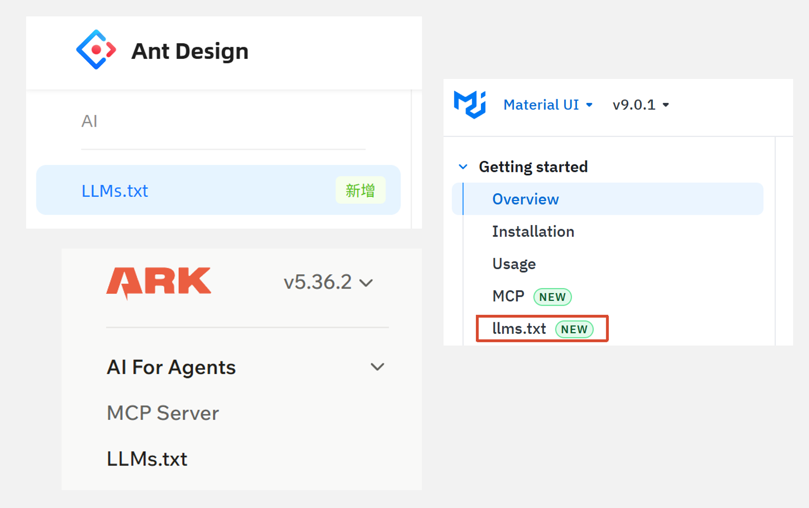
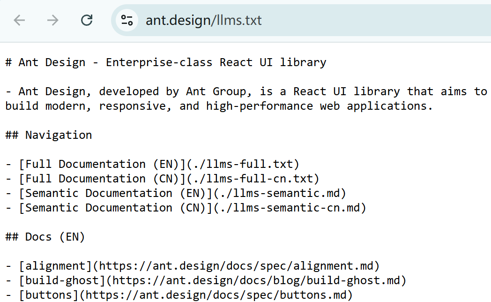
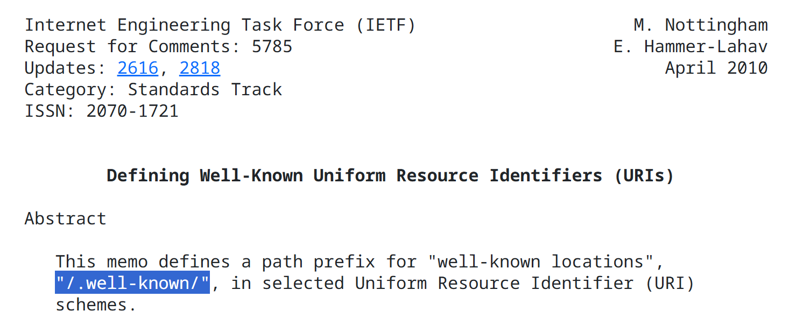
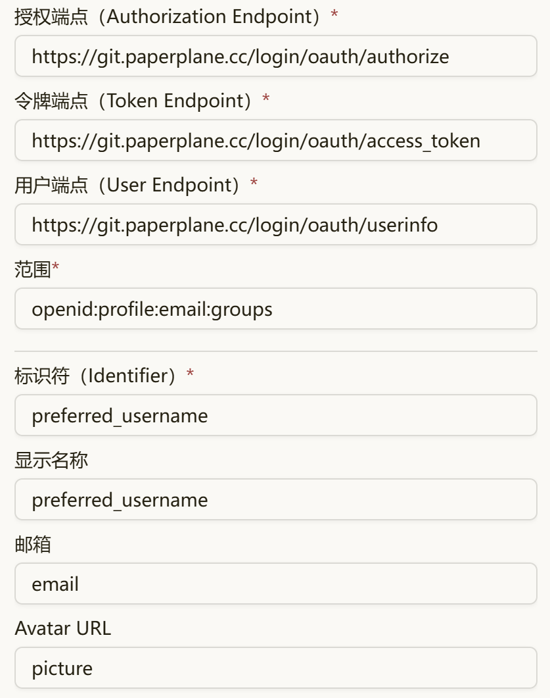
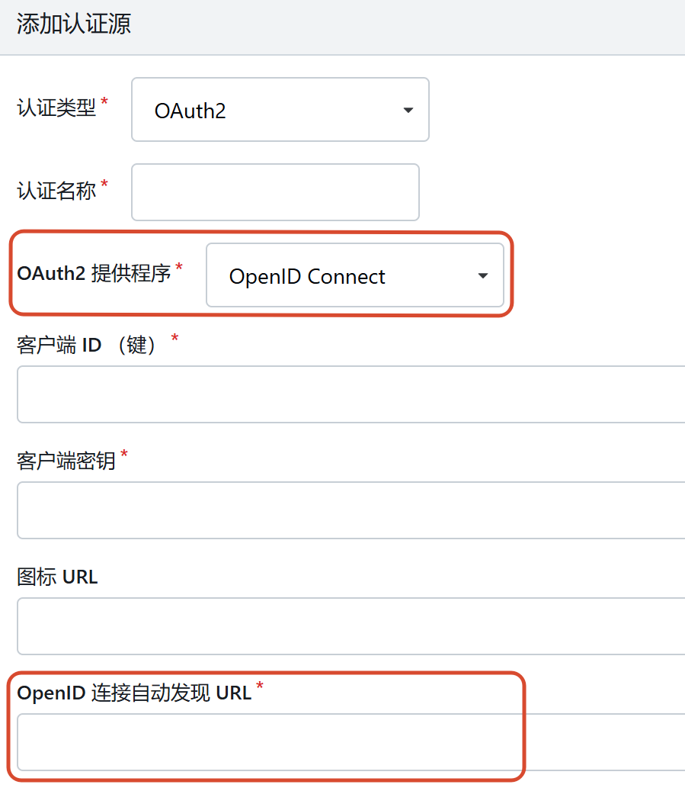
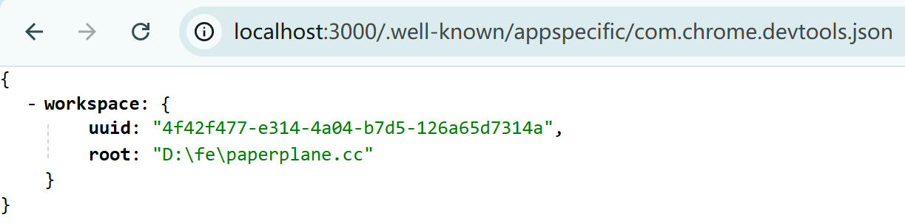
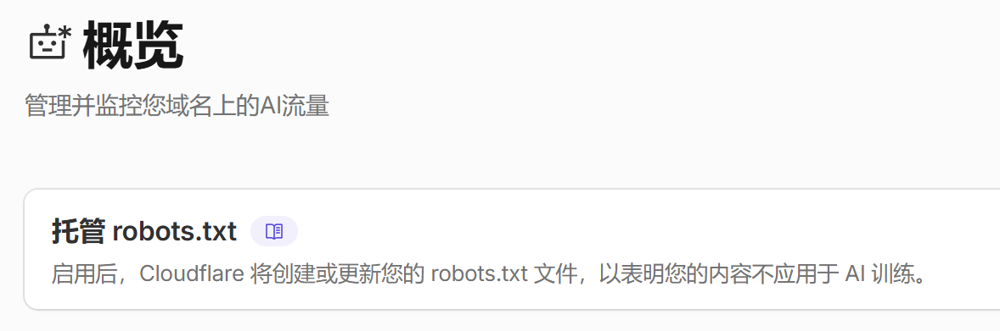

各个网站会采用一些有共识的路由约定对外提供一些声明或是暴露一些数据。举个最简单的例子，`/robots.txt` 熟悉吧？它就是网站对 “搜索引擎爬虫” 提供的声明。

曾经，只有 `robots.txt`、`sitemap.xml` 等几种路由约定。然而，现在是移动互联网和 AI Agent 普及的时间点，用户和开发者都对体验、安全性、开放数据有着更高的要求，因此也诞生了大量新的路由约定。本文旨在帮助开发者认识新兴的、最常见的几类路由约定。

# `LLMs.txt`

路由约定是这样的：

```
/llms.txt
```

实例：[GitHub](https://github.com/llms.txt)，[AntD](https://ant.design/llms.txt)，[Next.js](https://nextjs.org/llms.txt)。

<br />

如果你浏览过 AntD 等组件库的官方文档，你应该能看到很多网站都在侧边栏提供了醒目的 LLMs.txt 这一项，点击后往往是打开一个纯文本文件（AntD 则是打开一个介绍页）。

下图中是我找到的几个 UI 组件库官网，都不约而同地提供了这个文件：



**因为大模型很难理解交互式 Web 页面，因此，网站开发者可以为页面配备纯文本的内容介绍，便于 AI 大模型学习自己的网站内容；而这个约定好的纯文本文件，就是 `LLMs.txt`。**

访问这些文件，可以发现虽然后缀名写着是 `.txt`，但其实内容是 Markdown 格式。
这里以 AntD 官网的 `LLMs.txt` 为例：



<br />

简单来说 `LLMs.txt` 作为路由约定，它的目的是：暴露出一个文件，提供 Markdown 格式的提示文本帮助大模型了解网站的各部分 URL，各个页面的功能和内容。

在 [llms-txt 提案官网](https://llmstxt.org/) 可以找到更详细的介绍；还可以去他们的 [官方 GitHub 仓库](https://github.com/answerdotai/llms-txt) 提交建议或意见；
此外，在 [llmstxt.site](https://llmstxt.site/) 和 [directory.llmstxt.cloud](https://directory.llmstxt.cloud/) 可以找到支持 `LLMs.txt` 的网站列表，可以学习他们的写法。

---

下面简单讲解 LLMs.txt 文件。

先给出一份官方推荐的写法：

```markdown
# 示例网站 - Example.com

> 可选的网站摘要文本。

可选的网站介绍文本。

## 模块一标题

- [超链接1](https://example.com/link1): 一句话介绍此链接
- [超链接2](https://example.com/link2): 一句话介绍此链接
- [超链接3](https://example.com/link3): 一句话介绍此链接

## 模块二标题

- [超链接4](https://example.com/link4): 一句话介绍此链接
- [超链接5](https://example.com/link5): 一句话介绍此链接
- [超链接6](https://example.com/link6): 一句话介绍此链接
```

因为这份文件是给 AI Agent 看的，AI 把它当作提示词来理解，所以它没有什么强制性规范。
官网唯一给出的规范是：**第一行必须是一级标题，把网站的标题放在这里；** 后续内容均可随便写。

实际上，很多网站也只遵循这第一行的要求，后续内容比较自由，写法更像是我们自己项目的 `AGENTS.md` 或者是 `CLAUDE.md`。
例如，上图中 AntD 就在 `LLMs.txt` 中列出了若干个 `.txt` 和 `.md` 文档的链接，这看起来很像 Agent Skill 的写法。

## 作为用户使用 `LLMs.txt`

作为用户，可以通过提示词让 Agent 浏览某网站的 `LLMs.txt`，如果网站提供此文件，那么 Agent 便可以更加准确高效的获取网站信息。

例如在 AntD 的 `LLMs.txt` 介绍页中，官方提供了添加的系统提示词：

```
阅读 https://ant.design/llms-full.txt 并理解 Ant Design 组件库，在编写 Ant Design 代码时使用这些知识。
```

把这句话加到 `AGENTS.md` 或 `CLAUDE.md`，Agent 便可以得知去何处能学习组件库的用法，起到类似于 Agent Skill 的作用。

## 作为开发者提供 `LLMs.txt`

我们可以尝试在自己的网站中加入 `LLMs.txt`，提供更好的体验。

### 静态：使用 `/public` 目录

对于 Vite、Next.js、CRA 等项目而言，通用的做法是在 `/public` 目录下放置一个 `llms.txt` 文件，这个文件将被作为静态文件对外暴露。

### 动态：Next.js 使用 `/app/llms.txt/route.ts`

如果你希望 `LLMs.txt` 的内容是动态的，那么可以使用 Next.js 提供的 `route.ts` 文件约定；
创建 `/app/llms.txt/route.ts` 文件，在其中导出函数 `GET`，函数返回字符串结果即可：

```typescript
const llms_txt = `...` // 动态拼接等方式

export async function GET() {
  return new NextResponse(llms_txt, {
    headers: { 'Content-Type': 'text/plain; charset=utf-8' },
  })
}
```

这种 `route.ts` 写法会在每次请求进来时运行代码；
如果你的 `LLMs.txt` 只会在每次构建发布后改变，而不是随时根据数据库等内容动态生成的，那么可以把它改为静态模式，添加一行：

```typescript
export const dynamic = 'force-static'
```

即可实现。

---

本站也提供了 `LLMs.txt`，可通过 [PaperPlane.cc/llms.txt](https://paperplane.cc/llms.txt) 来访问。

本站的 `LLMs.txt` 是动态生成的，每当博客文章列表发生变化，例如发布新文章，列表中便会新增一条文章链接，可以在此 [查看源码](<https://github.com/chiskat/paperplane.cc/blob/main/app/(well-known)/llms.txt/route.ts>)。

## .md 后缀

`LLMs.txt` 提案的官网还提出，如果有可能，可以为每个页面提供一个 `.md` 后缀的路径，这个路径返回纯 Markdown 格式的内容；如果某个页面 URL 不含文件名，则使用 `/index.html.md`。

AntD 官网同样实现了这个规范：

- 组件原始文档 URL 后面加上 `.md`，即可访问 Markdown 格式的文档；
  例如： https://ant.design/components/button.md
- 如果改为在 URL 后面加上 `/semantic.md`，可以访问 “语义描述” 文档。
  例如： https://ant.design/components/button/semantic.md

---

PaperPlane.cc 的所有博客文章页面实现了此规范，每篇博文都提供对应 `.md` 后缀的纯 Markdown 文档；
例如现在这篇文章，可通过 [/post/well-known.md](https://paperplane.cc/post/well-known.md) 来访问它的 Markdown 格式文档。

<br />

这里简单说一下实现方式：

博客文章路由：`/app/post/[filename]/page.tsx`
博客 `.md` 路由：`/app/post/[filename]/md/route.ts`，在这个 `route.ts` 中，返回博客文章的原始 Markdown 即可。

因为我使用 `content-collections` 采集所有 `.md` 和 `.mdx` 文件的内容，其 `.content` 属性便是已去除 Front-Matter 的正文内容，把这些纯文本直接返回即可。

`route.ts` 文件源码：

```typescript
import { allArticles } from 'content-collections'
import { NextResponse } from 'next/server'

export { generateStaticParams } from '../page'

export async function GET(_request: Request, { params }: RouteContext<'/post/[filename]/md'>) {
  const { filename } = await params
  const article = allArticles.find(item => item._meta.path === filename)

  if (!article) {
    return new NextResponse('Not Found', { status: 404 })
  }

  return new NextResponse(article.content, {
    headers: { 'Content-Type': 'text/markdown; charset=utf-8' },
  })
}
```

当然仅这么做还不够，因为它对应的路由是 `/post/[filename]/md`，还需要想办法把 URL 的尾缀改成 `.md`。

在 `/netx.config.ts` 中添加路由重写：

```typescript {7}
import type { NextConfig } from 'next'

const nextConfig: NextConfig = {
  // ...
  async rewrites() {
    return {
      beforeFiles: [{ source: '/post/:filename.md', destination: '/post/:filename/md' }],
    }
  },
}

export default nextConfig
```

这样即可在访问 `.md` 的 URL 时，让 `/md` 的路由程序来处理请求。

# .well-known 系列

原先直接在网站根目录放置约定文件的方法，可能会导致时间越久网站根目录的杂乱文件越多，不利于管理。

为此，IETF 组织发布了 [RFC5785](https://datatracker.ietf.org/doc/html/rfc5785) 规范，规定了网站通过 `/.well-known/` 目录统一放置路由约定：



RFC5785 只规定了这个目录的存在，但各个网站和应用使用的路由并不统一。
为此，IANA 组织发布了 [Well-Known URIs](https://www.iana.org/assignments/well-known-uris/well-known-uris.xhtml)，这个网页中列出了各个网站目前达成共识的一些路由约定。

虽然列表中有很多，但实际上被广泛支持的只有几个，绝大部分都是 “冷门” 的用法；
本文将介绍最可能用到、最需要了解的一些条目。

## OIDC Discovery (OAuth 2)

路由约定是这样的：

```
/.well-known/openid-configuration
```

实例：[Google](https://accounts.google.com/.well-known/openid-configuration)、[微软](https://login.microsoftonline.com/common/v2.0/.well-known/openid-configuration)、[苹果](https://appleid.apple.com/.well-known/openid-configuration)。

### 前置知识：OIDC

[OpenID](https://openid.net/) 是一个技术基金会，维护和推广互联网上身份认证相关规范，且这些规范已被广泛采用；
而 OpenID Connect 是由 OpenID 基金会发布的建立在 OAuth 2 认证之上的一套更严格的 [规范](https://openid.net/specs/openid-connect-core-1_0.html)，简称 OIDC。

例如如果某个应用需要接入 OAuth 2 登录，如果目标网站遵循 OIDC 的规范，便可以以近乎 “零配置” 的方式接入，极大地简化了开发的复杂度。

<br />

举个例子，我自己部署了 [Memos](https://usememos.com/) 作为动态和备忘录工具，但不使用它自身的账号系统，而是 OAuth 2 接入到我部署的 [Gitea](https://git.paperplane.cc)，所有账号统一使用 Gitea 管理（现在这个网站也是，点右上角会发现只能使用 Gitea 登录）。

Memos 提供了 SSO 单点登录功能，但需要复杂的配置：



这个表单还有滚动条，底部还有若干个字段，配置非常复杂。

这是因为：OAuth 没有硬性规定每个接口的 path 如何，也没有规定用户的各个字段必须叫什么。

例如，上图中各个 “端点” 是 OAuth 的授权、令牌、用户信息接口 URL，每个 OAuth 提供方都要实现，但具体的 path 没有硬性规定，每个网站都不一样；
而且，每个网站的用户名称、头像、邮箱的字段各不相同，例如头像有的用 `avatar`，有的用 `image`；
所以，这些项目都需要接入方自行填写，非常麻烦。

OIDC 规范化了用户信息相关的字段名，例如：用户唯一 ID 必须叫 `sub`，账户名必须叫 `preferred_username`，头像必须叫 `picture`，邮箱必须叫 `email`，等等。
因此，如果是基于 OIDC 的 OAuth 认证，那么底下这几个输入框便不需要填写，因为字段已经被固定了。

### 什么是 OIDC Discovery

但是，OIDC 只规定了用户信息的字段名，却没有规定接口 URL，还是需要接入方挨个配置，并不方便。

于是，**OpenID Connect 提出了 “发现 (Discovery)” 机制，OIDC 给这个机制命名为 OpenID Connect Discovery，并提供了 [规范文档](https://openid.net/specs/openid-connect-discovery-1_0.html)。**

它运作方式是这样的：
只要网站允许第三方通过 OAuth 2 接入，便可通过以下约定路由对外暴露一段 JSON：

```
/.well-known/openid-configuration
```

这段 JSON 包含了 OAuth 各个接口的 URL，以及 OAuth 用户数据的字段、标识符字段名、加密算法等内容。

<br />

例如，Google 提供 OAuth 登录，第三方应用想接入 Google 的 OAuth 认证，如果工具支持，可以直接使用 OpenID Connect Discovery，地址如下：
https://accounts.google.com/.well-known/openid-configuration

同样，我部署的 Gitea 同样提供了这个路由约定，地址如下：
https://git.paperplane.cc/.well-known/openid-configuration

访问这个文件，便可以得到一段 JSON：

::: code-group

```json {3,4,6,18-23} [Gitea]
{
  "issuer": "https://git.paperplane.cc",
  "authorization_endpoint": "https://git.paperplane.cc/login/oauth/authorize",
  "token_endpoint": "https://git.paperplane.cc/login/oauth/access_token",
  "jwks_uri": "https://git.paperplane.cc/login/oauth/keys",
  "userinfo_endpoint": "https://git.paperplane.cc/login/oauth/userinfo",
  "introspection_endpoint": "https://git.paperplane.cc/login/oauth/introspect",
  "response_types_supported": [
    "code",
    "id_token"
  ],
  "id_token_signing_alg_values_supported": [
    "RS256"
  ],
  "subject_types_supported": [
    "public"
  ],
  "scopes_supported": [
    "openid",
    "profile",
    "email",
    "groups"
  ],
  "claims_supported": [
    "aud",
    "exp",
    "iat",
    "iss",
    "sub",
    "name",
    "preferred_username",
    "profile",
    "picture",
    "website",
    "locale",
    "updated_at",
    "email",
    "email_verified",
    "groups"
  ],
  "code_challenge_methods_supported": [
    "plain",
    "S256"
  ],
  "grant_types_supported": [
    "authorization_code",
    "refresh_token"
  ]
}
```

```json [Google]
{
 "issuer": "https://accounts.google.com",
 "authorization_endpoint": "https://accounts.google.com/o/oauth2/v2/auth",
 "device_authorization_endpoint": "https://oauth2.googleapis.com/device/code",
 "token_endpoint": "https://oauth2.googleapis.com/token",
 "userinfo_endpoint": "https://openidconnect.googleapis.com/v1/userinfo",
 "revocation_endpoint": "https://oauth2.googleapis.com/revoke",
 "jwks_uri": "https://www.googleapis.com/oauth2/v3/certs",
 "response_types_supported": [
  "code",
  "token",
  "id_token",
  "code token",
  "code id_token",
  "token id_token",
  "code token id_token",
  "none"
 ],
 "response_modes_supported": [
  "query",
  "fragment",
  "form_post"
 ],
 "subject_types_supported": [
  "public"
 ],
 "id_token_signing_alg_values_supported": [
  "RS256"
 ],
 "scopes_supported": [
  "openid",
  "email",
  "profile"
 ],
 "token_endpoint_auth_methods_supported": [
  "client_secret_post",
  "client_secret_basic"
 ],
 "claims_supported": [
  "aud",
  "email",
  "email_verified",
  "exp",
  "family_name",
  "given_name",
  "iat",
  "iss",
  "name",
  "picture",
  "sub"
 ],
 "code_challenge_methods_supported": [
  "plain",
  "S256"
 ],
 "grant_types_supported": [
  "authorization_code",
  "refresh_token",
  "urn:ietf:params:oauth:grant-type:device_code",
  "urn:ietf:params:oauth:grant-type:jwt-bearer"
 ],
 "authorization_response_iss_parameter_supported": true
}
```

:::

OIDC Discovery 规定了：

- OAuth 登录必须使用 `authorization_endpoint` 字段中的 URL；
- 授权码和密钥必须发给 `token_endpoint` 字段中的 URL；
- 拿到访问令牌后必须通过 `userinfo_endpoint` 字段中的 URL 去请求用户信息；
- OAuth 允许暴露 `scopes_supported` 作用域的用户信息；
- 等等...

可以看出，如果 Memos 支持 OIDC，那么这个表单几乎所有的输入控件都可以不用了，极大地简化配置方式。

---

在 OIDC 诞生之前，应用往往只能提供 Google、GitHub、Twitter 等几个大型互联网公司的 OAuth 登录接入，因为这些大型公司的接口定义往往是广泛普及且不会轻易改动的；如果想支持更多的配置，维护成本太高。

而 OIDC 的出现，使得任何应用都可以基于 OIDC 来 “发现” 其它网站的 OAuth 配置；应用除了提供几个大厂的 OAuth 登录接入之外，还可以提供 OIDC 登录，只需要让用户填入 OIDC 的发现地址，即可完成接入。

例如，Gitea 的认证源就是这样设计的：



### 作为接入方接入 OIDC Discovery

很多登录认证的库都支持 OIDC Discovery，作为开发者，使用这些库便可以非常简单地接入 OAuth 登录。

Next.js 生态登录认证组件 `next-auth`，现在已经升级进化为了 `better-auth`，本站也使用它；
可通过以下代码，比对 OIDC Discovery 启用与否的区别：

::: code-group

```typescript {13-18} [不使用]
import { betterAuth } from 'better-auth'
import { genericOAuth } from 'better-auth/plugins'

export const auth = betterAuth({
  plugins: [
    genericOAuth({
      config: [
        {
          providerId: '示例 Gitea OAuth2.0',
          clientId: '1111-2222-3333-4444',
          clientSecret: '5555666677778888',

          authorizationUrl: 'https://git.paperplane.cc/login/oauth/authorize',
          tokenUrl: 'https://git.paperplane.cc/login/oauth/access_token',
          userInfoUrl: 'https://git.paperplane.cc/login/oauth/userinfo',
          scopes: ['openid', 'profile', 'email', 'groups'],
          responseType: 'code',
          // ...
        },
      ],
    }),
  ]
})
```

```typescript {13} [使用 OIDC Discovery]
import { betterAuth } from 'better-auth'
import { genericOAuth } from 'better-auth/plugins'

export const auth = betterAuth({
  plugins: [
    genericOAuth({
      config: [
        {
          providerId: '示例 Gitea OAuth2.0',
          clientId: '1111-2222-3333-4444',
          clientSecret: '5555666677778888',

          discoveryUrl: process.env.OA2_DISCOVERY_URL,
        },
      ],
    }),
  ]
})
```

:::

可以看到，只要目标网站遵循路由约定，实现了 OIDC Discovery 的 URL，那么配置代码便可以简化很多。

### 作为开发者提供 OIDC Discovery

以 Next.js 网站为例，`better-auth` 同样提供了 OAuth 供应商的插件。
完整的配置太过复杂，本文会着重介绍其中 “路由约定” 的实现部分。

安装插件：

```bash
npm add @better-auth/oauth-provider
```

使用这个插件后，数据库表结构需要更新。

创建文件 `/app/.well-known/openid-configuration/route.ts`，填写：

```typescript
import { oauthProviderOpenIdConfigMetadata } from "@better-auth/oauth-provider";
import { auth } from "@/lib/auth"; // 此处目录取决于项目

export const GET = oauthProviderOpenIdConfigMetadata(auth);
```

可以看到，`better-auth` 插件已经提供了 OIDC Discovery 的实现，直接作为 HTTP 结果返回即可。

## acme-challenge

路由约定是这样的：

```
/.well-known/acme-challenge/*
```

<br />

ACME 协议全称 “自动化证书管理环境”，它用于自动化申请和部署 HTTPS 证书；因为免费证书往往期限很短，而一直盯着去换证书是没有必要的，因此产生了这么一套工具。本站也使用这种方式管理 HTTPS 证书。

HTTPS 证书是极其敏感的文件，在颁发时，一个很重要的事情是：**验证当前申请人实际拥有这个域名。**

有两种常用方式：

1. 通过 DNS 记录，证书机构生成一串编码，开发者把编码添加为 `TXT` 类型的 DNS 记录，证明有控制权；
2. 通过 ACME-Challenge，证书机构生成一个文件和一段 URL 路径，开发者在这个域名的主机的上，在给定的路径部署这个文件；
   后续证书机构会通过 80 端口的 HTTP 请求（或者是特殊的 TLS，走 443 端口）访问这个路径，查找这个文件是否存在且正确，能找到则表明申请人拥有域名的控制权。

这里，第二种方式就会使用这个路由约定，证书机构要求的路径一定是这样的：
`http://域名/.well-known/acme-challenge/路径`

::: info Tips

第一种认证方式可以完全确保申请人具备域名的控制权；
也正因如此，只有这种方式可以申请类似于 `*.example.com` 这样的泛域名证书。

第二种方式只能证明申请人能控制当前这一个域名。

:::

### 作为开发者使用 acme-challenge

如果使用 [ACME.sh](https://github.com/acmesh-official/acme.sh) 来管理网站的 HTTPS 证书，便可以使用这种方式向证书机构认证身份。

命令行示例：

```bash
acme.sh --issue -d example.com -w /path/to/acme-challenge
```

这里，`-d` 后面的域名替换成自己的域名，`-w` 后面的路径换成 Nginx 对外暴露的静态文件路径即可；
ACME.sh 会自动在 `-w` 的目录中创建 `.well-known/acme-chanllenge/` 目录。

对应的 Nginx 配置示例：

```nginx {5-8}
server {
  listen 80;
  server_name example.com;

  location ^~ /.well-known/acme-challenge/ {
    default_type "text/plain";
    root /path/to/acme-challenge/;
  }
}
```

注意需要使用 `80` 端口。也有一种 443 端口的认证方法，本文不再赘述。

---

自 v1.29.0 开始，Nginx 现在提供 [ngx_http_acme_module](https://nginx.org/en/docs/http/ngx_http_acme_module.html)，原生提供了 ACME 支持；
建议阅读官方文档，本文不再赘述。

### acme-challenge 存在的意义

这种认证方式，给了 Cloudflare、Vercel、腾讯云、阿里云等云计算厂商一种选择：
**用户即使不把域名的 DNS 接入厂商，也可以为用户的域名申请 HTTPS 证书。**

例如，Cloudflare 支持 “Cloudflare for SaaS” 功能，也就是 “自定义主机名”，允许用户把不在 Cloudflare 管理的域名也接入 Cloudflare 的服务。
（我们常说的 “Cloudflare IP 优选”，也需要用到这种方式，PaperPlane.cc 也使用此方式。）

假设我们要把 Cloudflare 上的某个服务 `project.pages.dev` 通过自定义主机名 `example.com` 来访问：
具体流程是这样的：

1. 第一次添加外部域名，Cloudflare 会要求我们在域名 `example.com` 的 DNS 记录添加 ACME 认证，以证明我们对域名有所有权；
2. 认证完成后，把 `example.com` 的域名通过 `CNAME` 解析到 `project.pages.dev` 即可。

第一次认证，Cloudflare 确保了我们对域名的所有权，同时，也会立即利用 “DNS 验证” 这种方式颁发域名的 HTTPS 证书；
后续 Cloudflare 服务器只要检测到访问来源的 SNI 是 `example.com`，就会提供这个 HTTPS 证书，正常工作。

第一张证书过期前，Cloudflare 会提前向证书机构申请新的 HTTPS 证书，证书机构需要验证身份，Cloudflare 便会在主机的 `/.well-known/acme-challenge/` 路径下放置相关验证文件，这样以来，**后续更新证书不再需要用户手动去配置 DNS 解析，只要云服务厂商还在托管这些服务，就可以自动完成新证书的颁发。**

## App 唤起与互通

iOS 和 Android 的路由约定路径不一样，其中 iOS 是这样的：

```
/.well-known/apple-app-site-association
```

Android 是这样的：

```
/.well-known/assetlinks.json
```

实例：[知乎 iOS](https://www.zhihu.com/.well-known/apple-app-site-association)，[知乎 Android](https://www.zhihu.com/.well-known/assetlinks.json)，[抖音 iOS](https://www.douyin.com/.well-known/apple-app-site-association)，[抖音 Android](https://www.douyin.com/.well-known/assetlinks.json)。

<br />

这些配置，目的是向手机操作系统证明此网站和某个 App 之间的关联性，正确配置后可以实现这些功能：

- URL 自动跳转 App，这种方式不像 URL Scheme 跳转 App 那样必须弹窗由用户确认；
- 在网页和 App 之间共享保存的账号密码；
- 等等...

相关文档：

- [iOS 的 apple-app-site-association 配置文档](https://developer.apple.com/documentation/xcode/supporting-associated-domains)
- [Android 的 assetlinks.json 配置文档](https://developer.android.google.cn/training/app-links/verify-applinks)

## Chrome DevTools

路由约定是这样的：

```
/.well-known/appspecific/com.chrome.devtools.json
```

在开发调试 Next.js 等前端项目时，开发工具控制台可能会有访问提示。

例如，PaperPlane.cc 本地开发时，访问此路由约定 URL：



其中 `root` 就是此项目的代码在本机的目录。

<br />

[Well-Known URIs](https://www.iana.org/assignments/well-known-uris/well-known-uris.xhtml) 规范规定了，开发者可以在 `/.well-known/appspecific/` 路径下使用私有的路由约定，专门为自家 App 或工具提供约定；
因此，这个路径其实是 Chrome 浏览器的 “私货”，用于方便开发调试。

[Chrome 官方文档](https://developer.chrome.com/docs/devtools/automatic-workspaces) 称之为 “自动连接工作区”，在浏览器中按下 F12 后，Chrome 便请求这个 URL，并根据返回的 JSON 文件找到本地的工作区，从而实现开发调试、SourceMap 自动加载等各种功能。

目前，Next.js 已实现此 URL 路由约定，但 Vite 似乎暂未支持，可以通过 [`vite-plugin-devtools-json`](https://github.com/ChromeDevTools/vite-plugin-devtools-json) 插件来提供支持。

## 其它

在 [Well-Known URIs](https://www.iana.org/assignments/well-known-uris/well-known-uris.xhtml) 上可以看到，还有很多 `/.well-known/` 的路由约定，只不过大多数都没有被普及。

举几个例子：

- `/.well-known/security.txt` 对外公示网站的安全联络方式（实例：[GitHub](https://github.com/.well-known/security.txt)），只要相关用户或爱好者找到了网站的漏洞，便可以通过此联系方式联络网站管理员，通常可以得到奖励；
- `/.well-known/change-password` 预期会跳转到网站的 “修改密码” 网址（实例：[GitHub](https://github.com/.well-known/change-password)，[Apple](https://www.apple.com/.well-known/change-password)），因为浏览器和密码管理工具有自动检测已泄露密码的功能，如果检测到，便会通过此路由约定引导用户跳转到 “修改密码” 处。

# `sitemap.xml`

路由约定是这样的：

```
/sitemap.xml
```

实例：[Google](https://www.google.com/sitemap.xml)，[Apple](https://www.apple.com/sitemap.xml)。

<br />

[Sitemap](https://www.sitemaps.org/) 是一个诞生极早的规则，顾名思义，它是一个 “站点地图” XML 文件，是网站各个页面的索引文件。
搜索引擎爬虫程序在访问某个网站时，如果能读取到此文件，便可以快速高效的爬取各个页面的数据。

原始的规范文件太过古老，现在建议根据 [Google SEO 站点地图文档](https://developers.google.cn/search/docs/crawling-indexing/sitemaps/overview) 来了解和实现它；
站长可在 Google Search Console 的 [Sitemap](https://search.google.com/search-console/sitemaps) 页面主动推送站点地图。

`sitemap.xml` 是一个严格的 XML 文件，它必须是 UTF-8 格式、大小不能超过 50MB、包含的 URL 不能超过 50000 个；
它的格式如下：

```xml
<?xml version="1.0" encoding="UTF-8"?>
<urlset xmlns="http://www.sitemaps.org/schemas/sitemap/0.9">
  <url>
    <loc>https://www.example.com/</loc>
    <lastmod>2026-01-01</lastmod>
    <changefreq>daily</changefreq>
    <priority>1.0</priority>
  </url>
  <!-- ... -->
</urlset>
```

这里面每个 `<url>` 便是一个页面的索引，一个 `sitemap.xml` 中往往包含了几十个 `<url>`；
它的各个字段含义如下：

- `<loc>`：索引到的页面的完整 URL；
- `<lastmod>`：页面最后修改的日期，必须是 `YYYY-MM-DD` 格式的日期；
- `<changefreq>`：页面预期更新频率，向搜索引擎建议的抓取频率；
  值必须为以下之一：`always`, `hourly`, `daily`, `weekly`, `monthly`, `yearly`, `never`；
- `<priority>`：优先级，是一个范围 `0~1.0` 的数字。

> Google 曾 [明确表明](https://developers.google.cn/search/blog/2023/06/sitemaps-lastmod-ping)，会忽略 `changefreq` 和 `priority` 字段内容，而会着重关注 `lastmod` 字段。

<br />

Google 支持 “图片”、“新闻”、“视频” 等多种扩展语法，举例：

```xml
<?xml version="1.0" encoding="UTF-8"?>
<urlset xmlns="http://www.sitemaps.org/schemas/sitemap/0.9"
    xmlns:image="http://www.google.com/schemas/sitemap-image/1.1">
  <url>
    <loc>https://example.com/sample1.html</loc>
    <image:image>
      <image:loc>https://example.com/image.jpg</image:loc>
    </image:image>
    <image:image>
      <image:loc>https://example.com/photo.jpg</image:loc>
    </image:image>
  </url>
</urlset>
```

在 `<urlset>` 里添加 Google 的规则 `xmlns:image=...`，给这个 XML 引入 `image` 这个命名空间，便可以使用 `image:` 开头的标签用于描述页面中的图片。
Google 还提供了视频 `video:`、新闻 `news:` 等多种格式。

更多用法， 建议参考 [Google SEO 站点地图文档](https://developers.google.cn/search/docs/crawling-indexing/sitemaps/overview)，本文不再赘述。

---

需要注意的是，`sitemap.xml` 所处路径不局限于网页根目录，在某个子目录下也是可以的。因为大型网站的页面很多，也可能会区分多个子模块，这种情况下，便可以准备多份 `sitemap.xml`，在根级的 `sitemap.xml` 中放置其它文件的链接。

此时，格式是这样的：

```xml
<?xml version="1.0" encoding="UTF-8"?>
<sitemapindex xmlns="http://www.sitemaps.org/schemas/sitemap/0.9">
  <sitemap>
    <loc>https://www.example.com/path/sitemap.xml</loc>
    <lastmod>2026-01-01</lastmod>
  </sitemap>
  <!-- ... -->
</sitemapindex>
```

它和普通的 `sitemap.xml` 基本一致，只不过 `<urlset>` 换成了 `<sitemap>`，而 `<url>` 换成了 `<sitemap>`。

---

此外，网站如果配备了 `sitemap.xml`，那么建议在 `/robots.txt` 末尾加上一行：

```
# ...

Sitemap: https://www.example.com/sitemap.xml
```

这样更有助于各个爬虫程序发现此文件。

## 作为开发者实现 `sitemap.xml`

**SPA 网站：**

如果是 SPA 网站，`sitemap.xml` 通常是静态的，实现方式非常简单：
Vite、CRA 等框架，直接添加 `/public/sitemap.xml` 文件，并填写内容即可。

如果 `sitemap.xml` 的内容需要通过代码生成，例如遍历某目录下的文件来生成，那么可以使用相关插件：

- Vite 插件 [vite-plugin-sitemap](https://github.com/jbaubree/vite-plugin-sitemap)
- 通用生成工具 [sitemap-ts](https://github.com/jbaubree/sitemap-ts)

---

**Next.js：**

Next.js 原生支持 `sitemap.xml`，可在 `app` 目录下直接创建 `sitemap.xml`，此时便是静态实现；
如果创建的是 `sitemap.ts`（或 `.js`），那么便可通过代码来生成 `sitemap.xml`。

Next.js 允许开发者在 `sitemap.ts` 中直接返回一个数组，由 Next.js 来拼接成 XML 格式。此外，Next.js 也支持 Google 的 `<image:image>` 等标签。
具体使用方式，可以参考 [Next.js sitemap.xml 文档](https://nextjs.org/docs/app/api-reference/file-conventions/metadata/sitemap)。

只要没有明确声明，且没有用到请求 Request 的任何内容来参与计算，那么 `sitemap.ts` 的返回值是默认已缓存的。

---

本站使用 Next.js 代码预生成站点地图。
可在 [`PaperPlane.cc/sitemap.xml`](https://paperplane.cc/sitemap.xml) 访问本站的站点地图，或是 [查看源码](http://github.com/chiskat/paperplane.cc/blob/main/app/sitemap.ts)。

# `robots.txt`

路由约定是这样的：

```
/robots.txt
```

实例：[GitHub](https://github.com/robots.txt)，[Bilibili](https://www.bilibili.com/robots.txt)，[百度](https://www.baidu.com/robots.txt)。

<br />

一句话就能介绍清楚：“给搜索引擎爬虫看的”；这个路由约定已经非常普及了，不必过多介绍。
可在 IETF 找到 `robots.txt` 的规范文档 [RFC9309](https://datatracker.ietf.org/doc/html/rfc9309)，也可以通过 [Google SEO robots.txt 文档](https://developers.google.cn/crawling/docs/robots-txt/create-robots-txt) 了解此文件对搜索引擎爬虫程序的影响。

站长可在 Google Search Console 的 [robot.txt 页面](https://search.google.com/search-console/settings/robots-txt) 主动推送 `robots.txt`。

## 作为开发者实现 `robots.txt`

**外部管理：**

考虑到 `robots.txt` 比较特殊，可能不会放在源码中管理，而是通过一些方式单独管理。
如果使用 Nginx 管理，可以参考我的另一篇博客文章 [《Nginx 进阶》](https://paperplane.cc/post/nginx-advanced)。

此外，云服务厂商提供的网关服务，可能也能代为用户托管 `robots.txt`，例如 Cloudflare 就有此功能：



---

**SPA 网站：**

对于 Vite 和 CRA 项目而言，和 `sitemap.xml` 类似，直接添加 `/public/robots.txt` 文件即可。

如果 `robots.txt` 需要通过代码来生成，可以使用 [vite-plugin-robots-txt](https://github.com/dev-zarghami/vite-plugin-robots-txt) 这类插件。

---

**Next.js：**

Next.js 原生支持 `robots.txt`，可在 `app` 目录下直接创建 `robots.txt`，此时便是静态实现；
如果创建的是 `robots.ts`（或 `.js`），那么这个文件便是通过代码来生成的。

只要没有明确声明，且没有用到请求 Request 的任何内容来参与计算，那么 `robots.ts` 的返回值是默认已缓存的。

Next.js 允许开发者在 `robots.ts` 中直接返回一个对象，由 Next.js 来处理成纯文本。
具体使用方式，可以参考 [Next.js robots.txt 文档](https://nextjs.org/docs/app/api-reference/file-conventions/metadata/robots)。

---

本站使用 Next.js 代码预生成 `robots.txt`。
可在 [`PaperPlane.cc/robots.txt`](https://paperplane.cc/robots.txt) 访问本站的 `robots.txt`，或是 [查看源码](https://github.com/chiskat/paperplane.cc/blob/main/app/robots.ts)。

# `favicon.ico`

路由约定是这样的：

```
/favicon.ico
```

<br />

你可能会有疑问，网页的图标是通过 `<link>` 标签来指定的，就像这样：

```html
<link rel="icon" type="image/x-icon" href="favicon.ico">
```

首先，很多网站都会通过这个 `<link>` 来指定图标的文件，此外，`.ico` 格式并不常用，很多网站使用 `.png` 甚至 `.svg` 格式的高清大图来作为图标。
以上很多种情况，它的 URL 路径并不一定是 `/favicon.ico`，为什么称之为 “路由约定”？

这是因为，如果某个网站的 HTML 中没有放置这个 `<link>`，或者，用户访问的 URL 压根不是 HTML，比如返回的是 JSON 数据或者图片，此时浏览器默认就会访问 `/favicon.ico` 来读取图标。

也正因为上述原因，如果希望用户在访问任何页面，包括网站下的图片、JSON 接口时，浏览器都能在标签页渲染正确的 icon，那么建议使用 `/favicon.ico` 这个图标。

> 如果网站不打算提供 `favicon.ico`，建议这样写 HTML：
>
> ```html
> <link rel="icon" href="data:,">
> ```
>
> 浏览器读取后，就不会发送请求了，也可以避免 Nginx 里面一堆 404 的记录。

## 作为开发者实现 `favicon.ico`

首先，`.ico` 是微软提出的一种图片封装格式，允许多尺寸的图片封装在一个文件里；而且它的标准经过演进，现在支持透明背景图片。
开发者可以通过 [Convert.io](https://convertio.co/zh/) 来把图片转为 `.ico` 格式。

---

**SPA：**

对于 Vite 或 CRA 项目，可以将 `favicon.ico` 放在 `/public` 目录中，确保 `index.html` 中有以下内容：

```html
<link rel="icon" type="image/x-icon" href="/favicon.ico">
```

因为 `favicon.ico` 的文件名是被定死的，所以文件名中不能添加 hash。

---

**Next.js：**

Next.js 会自动读取 `app` 目录下的图标文件，尤其是 `app` 目录下直接子级 `favicon.ico` 文件，因为它将作为整个网站的默认图标，毕竟有路由约定的存在；
此外，Next.js 还会在 `app` 目录下所有层级中读取 `icon` 开头、`png` / `jpg` / `svg` 等多种后缀的图片，这些将作为各个子目录页面的图标。

你甚至可以通过 `icon.ts` 或者 `icon.tsx` 来通过代码动态返回图标。

因为 `favicon.ico` 的文件名是被定死的，所以文件名中不能添加 hash；
Next.js 的处理方式是在 URL 的查询参数中添加 hash：

```html
<link rel="icon" href="/favicon.ico?favicon.0d397iwfl48hr.ico" sizes="117x117" type="image/x-icon"/>
```

甚至，即使配置了 `assetPrefix` 将资源放在外部 CDN 了，Next.js 仍会保持 `favicon.ico` 放在网站自身路径下；
而 Vite 配置了 `base` 后，`favicon.ico` 会使用外部 CDN 链接，这便不符合路由约定。

可见，Next.js 对图标的处理非常完善且专业。更多内容可以参考其 [官网文档](https://nextjs.org/docs/app/api-reference/file-conventions/metadata/app-icons)。

## `apple-touch-icon.png`

路由约定是这样的：

```
/apple-touch-icon.png
```

实例：[GitHub](https://github.com/apple-touch-icon.png)，[Steam](https://store.steampowered.com/apple-touch-icon.png)，[Apple](https://www.apple.com/apple-touch-icon.png)。

<br />

这是给 Apple 设备专用的图标文件，它通常是一个高清 `.png` 图片，也支持多种尺寸;当使用浏览器的 “添加到桌面” 功能时，就会使用这个图片；此外，收藏网页等其它情况，也可能使用这里的图标。
可在 Apple 开发者 [官网文档](https://developer.apple.com/library/archive/documentation/AppleApplications/Reference/SafariWebContent/ConfiguringWebApplications/ConfiguringWebApplications.html) 进一步了解。

它和 `favicon.ico` 很像，开发者可在 HTML 中通过 `<link>` 指定路径：

```html
<link rel="apple-touch-icon" href="apple-touch-icon.png">
```

如果没有指定此项，那么浏览器就会按照 `/apple-touch-icon.png` 这个路由约定读取图标文件。

---

它的实现方式和 `favicon.ico` 很像，在 `public` 目录下创建文件即可。

Next.js 则可通过 `apple-icon.png` 或 `apple-icon.tsx` 来提供这个文件，具体可以参考 [官网文档](https://nextjs.org/docs/app/api-reference/file-conventions/metadata/app-icons)。

# RSS

比较 “标准” 的路由约定是这样的：

```
/rss.xml
/atom.xml
/feed.xml
```

因为 RSS 在过去的发展中，产生过多个标准，还有 `/feed/`、`/feed.rss`、`/rss` 等非标准的路径，举例可能根本举不完。
上面列出的 3 个，是最接近 “标准” 的，且被广大 RSS 阅读器支持。

网站支持 RSS 的最直接方式，是在 HTML 里添加以下内容：

```html
<link rel="alternate" type="application/rss+xml" title="标题" href="/rss.xml" />
```

如果有这一段，那么 RSS 阅读器可以直接订阅；否则，RSS 阅读器可能就会用上述路由约定进行扫描。

## 作为开发者实现 RSS 链接

可以通过 [feed](https://github.com/jpmonette/feed) 来生成 RSS 订阅 XML。

对于 Vite、CRA 等项目，可通过插件在编译构建阶段读取特定文件（例如文章列表），来生成一份 RSS 订阅；
而 Next.js、Nuxt.js 项目，可通过自定义路由，使用 `feed` 生成 XML 结构返回，这个过程可以是动态的，例如查询数据库。

---

本站使用 `feed` 分别生成了 [`rss.xml`](https://paperplane.cc/rss.xml)、[`atom.xml`](https://paperplane.cc/atom.xml)、[`feed.xml`](https://paperplane.cc/feed.xml)；
这里利用了 Next.js 的自定义路由 `route.ts`、`feed` 以及 Next.js 静态生成，点击 [查看源码](<https://github.com/chiskat/paperplane.cc/blob/main/app/(well-known)/feed.xml/_feed.ts>)。
